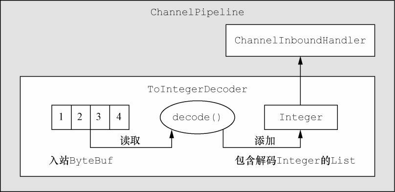
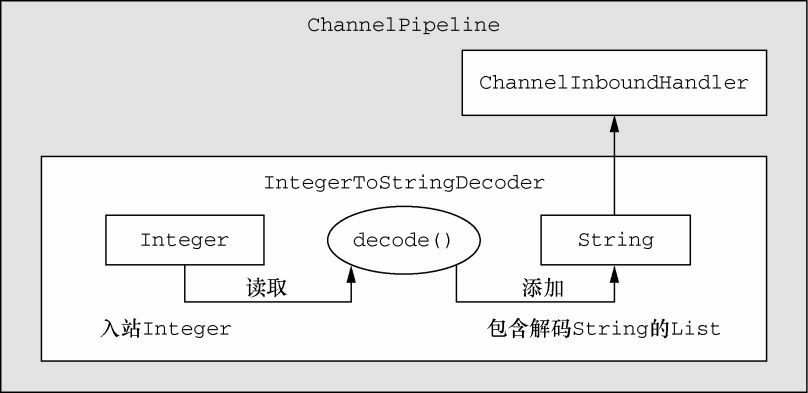
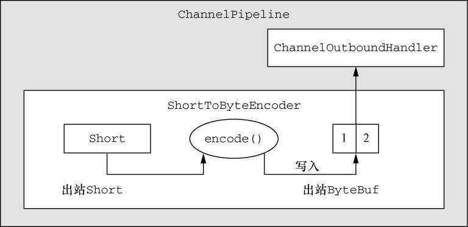
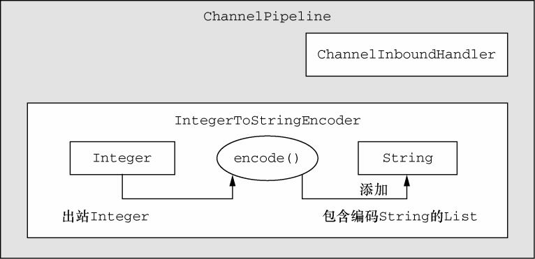

### 解码器 ###

- 将字节解码为消息——`ByteToMessageDecoder`和`ReplayingDecoder`；
- 将一种消息类型解码为另一种——`MessageToMessageDecoder`。

#### 抽象类ByteToMessageDecoder ####

下面举一个如何使用这个类的示例，假设你接收了一个包含简单int的字节流，每个int都需要被单独处理。在这种情况下，你需要从入站ByteBuf中读取每个int，并将它传递给ChannelPipeline中的下一个ChannelInboundHandler。为了解码这个字节流，你要扩展ByteToMessageDecoder类。（需要注意的是，原子类型的int在被添加到List中时，会被自动装箱为Integer。）



```java
public class ToIntegerDecoder extends ByteToMessageDecoder {
    
    @Override
    public void decode(ChannelHandlerContext ctx, ByteBuf in, List<Object> out) throws Exception {
        if (in.readableBytes() >= 4) {
            out.add(in.readInt());
        }
    }
}
```

虽然ByteToMessageDecoder使得可以很简单地实现这种模式，但是你可能会发现，在调用readInt()方法前不得不验证所输入的ByteBuf是否具有足够的数据有点繁琐。在下一节中，我们将讨论ReplayingDecoder，它是一个特殊的解码器，以少量的开销消除了这个步骤。


#### 抽象类ReplayingDecoder ####

ReplayingDecoder扩展了ByteToMessageDecoder类，使得我们不必调用`readableBytes()`方法。它通过使用一个自定义的ByteBuf实现——ReplayingDecoderByteBuf，包装传入的ByteBuf实现了这一点，其将在内部执行该调用。

下列代码展示了基于`ReplayingDecoder`重新实现的`ToIntegerDecoder`。

```java
public class ToIntegerDecoder2 extends ReplayingDecoder<Void> {

    @Override
    public void decode(ChannelHandlerContext ctx, ByteBuf in, List<Object> out) throws Exception {
        //传入的ByteBuf是ReplayingDecoderByteBuf类型
        out.add(in.readInt());
    }
}
```


#### 抽象类MessageToMessageDecoder ####

在这一节中，我们将解释如何使用下面的抽象基类在两个消息格式之间进行转换（例如，从一种POJO类型转换为另一种）：

```java
public abstract class MessageToMessageDecoder<I> extends ChannelInboundHandlerAdapter
```

在这个示例中，我们将编写一个IntegerToStringDecoder解码器来扩展MessageToMessageDecoder\<Integer\>。它的decode()方法会把Integer参数转换为它的String表示，然后解码的String将被添加到传出的List中，并转发给下一个ChannelInboundHandler。



```java
public class IntegerToStringDecoder extends MessageToMessageDecoder<Integer> {

    @Override
    protected void decode(ChannelHandlerContext ctx, Integer msg, List<Object> out) throws Exception {
        out.add(String.valueOf(msg));
    }
}
```


#### TooLongFrameException类 ####

由于Netty是一个异步框架，所以需要在字节可以解码之前在内存中缓冲它们。因此，不能让解码器缓冲大量的数据以至于耗尽可用的内存。为了解除这个常见的顾虑，Netty提供了TooLongFrameException类，其将由解码器在帧超出指定的大小限制时抛出。

为了避免这种情况，你可以设置一个最大字节数的阈值，如果超出该阈值，则会导致抛出一个TooLongFrameException（随后会被ChannelHandler.exceptionCaught()方法捕获）。然后，如何处理该异常则完全取决于该解码器的用户。某些协议（如HTTP）可能允许你返回一个特殊的响应。而在其他的情况下，唯一的选择可能就是关闭对应的连接。

下列代码展示了`ByteToMessageDecoder`是如何使用`TooLongFrameException`来通知ChannelPipeline中的其他ChannelHandler发生了帧大小溢出的。需要注意的是，如果你正在使用一个可变帧大小的协议，那么这种保护措施将是尤为重要的。

```java
public class SafeByteToMessageDecoder extends ByteToMessageDecoder {
    private static final int MAX_FRAME_SIZE = 1024;

    @Override
    protected void decode(ChannelHandlerContext ctx, ByteBuf in, List<Object> out) throws Exception {
        int readable = in.readableBytes();
        //检查缓冲区中是否有超过MAX_FRAME_SIZE个字节
        if (readable > MAX_FRAME_SIZE) {
            //跳过所有的可读字节，抛出TooLongFrame-Exception 并通知ChannelHandler
            in.skipBytes(readable);
            throw new TooLongFrameException("Frame too big!");
        }

        //do something else
    }
}
```


### 编码器 ###

回顾一下我们先前的定义，编码器实现了ChannelOutboundHandler，并将出站数据从一种格式转换为另一种格式，和我们方才学习的解码器的功能正好相反。Netty提供了一组类，用于帮助你编写具有以下功能的编码器：

- 将消息编码为字节；
- 将消息编码为消息。


#### 抽象类MessageToByteEncoder ####

前面我们看到了如何使用`ByteToMessageDecoder`来将字节转换为消息。现在我们将使用`MessageToByteEncoder`来做逆向的事情。

下图展示了`ShortToByteEncoder`，其接受一个Short类型的实例作为消息，将它编码为Short的原子类型值，并将它写入ByteBuf中，其将随后被转发给ChannelPipeline中的下一个ChannelOutboundHandler。每个传出的Short值都将会占用ByteBuf中的2字节。



```java
public class ShortToByteEncoder extends MessageToByteEncoder<Short> {

    @Override
    protected void encode(ChannelHandlerContext ctx, Short msg, ByteBuf out) throws Exception {
        //将Short写入ByteBuf 中
        out.writeShort(msg);
    }
}
```


#### 抽象类MessageToMessageEncoder ####

为了演示，下面代码清单使用`IntegerToStringEncoder`扩展了MessageToMessageEncoder。其设计如下图所示。



```java
public class IntegerToStringEncoder extends MessageToMessageEncoder<Short> {

    @Override
    protected void encode(ChannelHandlerContext ctx, Short msg, List<Object> out) throws Exception {
        //将Integer转换为String，并将其添加到List中
        out.add(String.valueOf(msg));
    }
}
```


### 抽象的编解码器类 ###

#### 抽象类ByteToMessageCodec ####

让我们来研究这样的一个场景：我们需要将字节解码为某种形式的消息，可能是POJO，随后再次对它进行编码。ByteToMessageCodec将为我们处理好这一切，因为它结合了ByteToMessageDecoder以及它的逆向——MessageToByteEncoder。


#### 抽象类MessageToMessageCodec ####

在前面章节中，你看到了一个扩展了MessageToMessageEncoder以将一种消息格式转换为另外一种消息格式的例子。通过使用MessageToMessageCodec，我们可以在一个单个的类中实现该转换的往返过程。

```java
public abstract class MessageToMessageCodec<INBOUND_IN,OUTBOUND_IN>
```

我们的`WebSocketConvertHandler`在参数化`MessageToMessageCodec`时将使用INBOUND_IN类型的WebSocketFrame，以及OUTBOUND_IN类型的MyWebSocketFrame，后者是WebSocketConvertHandler本身的一个静态嵌套类。

```java
package cn.zifangsky.netty.exercise.chapter10;

import io.netty.buffer.ByteBuf;
import io.netty.channel.ChannelHandler.Sharable;
import io.netty.channel.ChannelHandlerContext;
import io.netty.handler.codec.MessageToMessageCodec;
import io.netty.handler.codec.http.websocketx.*;

import java.util.List;

/**
 * Using MessageToMessageCodec
 *
 * @author zifangsky
 * @date 2020/10/22
 * @since 1.0.0
 */
@Sharable
public class WebSocketConvertHandler extends MessageToMessageCodec<WebSocketFrame, WebSocketConvertHandler.MyWebSocketFrame> {
     @Override
     protected void encode(ChannelHandlerContext ctx, WebSocketConvertHandler.MyWebSocketFrame msg, List<Object> out) throws Exception {
         ByteBuf payload = msg.getData().duplicate().retain();
         
         //实例化一个指定子类型的WebSocketFrame
         switch (msg.getType()) {
             case BINARY:
                 out.add(new BinaryWebSocketFrame(payload));
                 break;
             case TEXT:
                 out.add(new TextWebSocketFrame(payload));
                 break;
             case CLOSE:
                 out.add(new CloseWebSocketFrame(true, 0, payload));
                 break;
             case CONTINUATION:
                 out.add(new ContinuationWebSocketFrame(payload));
                 break;
             case PONG:
                 out.add(new PongWebSocketFrame(payload));
                 break;
             case PING:
                 out.add(new PingWebSocketFrame(payload));
                 break;
             default:
                 throw new IllegalStateException("Unsupported websocket msg " + msg);}
    }

    @Override
    protected void decode(ChannelHandlerContext ctx, WebSocketFrame msg, List<Object> out) throws Exception {
        ByteBuf payload = msg.content().duplicate().retain();

        //将WebSocketFrame 解码为MyWebSocketFrame，并设置FrameType
        if (msg instanceof BinaryWebSocketFrame) {
            out.add(new MyWebSocketFrame(MyWebSocketFrame.FrameType.BINARY, payload));
        } else
        if (msg instanceof CloseWebSocketFrame) {
            out.add(new MyWebSocketFrame (MyWebSocketFrame.FrameType.CLOSE, payload));
        } else
        if (msg instanceof PingWebSocketFrame) {
            out.add(new MyWebSocketFrame (MyWebSocketFrame.FrameType.PING, payload));
        } else
        if (msg instanceof PongWebSocketFrame) {
            out.add(new MyWebSocketFrame (MyWebSocketFrame.FrameType.PONG, payload));
        } else
        if (msg instanceof TextWebSocketFrame) {
            out.add(new MyWebSocketFrame (MyWebSocketFrame.FrameType.TEXT, payload));
        } else
        if (msg instanceof ContinuationWebSocketFrame) {
            out.add(new MyWebSocketFrame (MyWebSocketFrame.FrameType.CONTINUATION, payload));
        } else{
            throw new IllegalStateException("Unsupported websocket msg " + msg);
        }
    }

    public static final class MyWebSocketFrame {
        public enum FrameType {
            BINARY,
            CLOSE,
            PING,
            PONG,
            TEXT,
            CONTINUATION
        }
        private final FrameType type;
        private final ByteBuf data;

        public MyWebSocketFrame(FrameType type, ByteBuf data) {
            this.type = type;
            this.data = data;
        }
        public FrameType getType() {
            return type;
        }
        public ByteBuf getData() {
            return data;
        }
    }
}
```


#### CombinedChannelDuplexHandler类 ####

正如我们前面所提到的，结合一个解码器和编码器可能会对可重用性造成影响。但是，有一种方法既能够避免这种惩罚，又不会牺牲将一个解码器和一个编码器作为一个单独的单元部署所带来的便利性。`CombinedChannelDuplexHandler`提供了这个解决方案，其声明为：

```java
public class CombinedChannelDuplexHandler<I extends ChannelInboundHandler, O extends ChannelOutboundHandler>
        extends ChannelDuplexHandler
```

这个类充当了`ChannelInboundHandler`和`ChannelOutboundHandler`（该类的类型参数I和O）的容器。通过提供分别继承了解码器类和编码器类的类型，我们可以实现一个编解码器，而又不必直接扩展抽象的编解码器类。我们将在下面的示例中说明这一点。

首先，让我们研究一下下列代码中的`ByteToCharDecoder`。注意，该实现扩展了ByteToMessageDecoder，因为它要从ByteBuf中读取字符。

```java
public class ByteToCharDecoder extends ByteToMessageDecoder {
    
    @Override
    public void decode(ChannelHandlerContext ctx, ByteBuf in, List<Object> out) throws Exception {
        if (in.readableBytes() >= 2) {
            out.add(in.readChar());
        }
    }
}
```

这里的decode()方法一次将从ByteBuf中提取2字节，并将它们作为char写入到List中，其将会被自动装箱为Character对象。

其次，让我们研究一下下列代码中的`CharToByteEncoder`，它能将Character转换回字节。这个类扩展了MessageToByteEncoder，因为它需要将char消息编码到ByteBuf中。这是通过直接写入ByteBuf做到的。

```java
public class CharToByteEncoder extends MessageToByteEncoder<Character> {
    
    @Override
    public void encode(ChannelHandlerContext ctx, Character msg, ByteBuf out) throws Exception {
        out.writeChar(msg);
    }
}
```

最后，既然我们有了解码器和编码器，我们将会结合它们来构建一个编解码器。

```java
public class CombinedByteCharCodec extends CombinedChannelDuplexHandler<ByteToCharDecoder, CharToByteEncoder> {

    public CombinedByteCharCodec() {
        //将委托实例传递给父类
        super(new ByteToCharDecoder(), new CharToByteEncoder());
    }
}
```

正如你所能看到的，在某些情况下，通过这种方式结合实现相对于使用编解码器类的方式来说可能更加的简单也更加的灵活。当然，这可能也归结于个人的偏好问题。