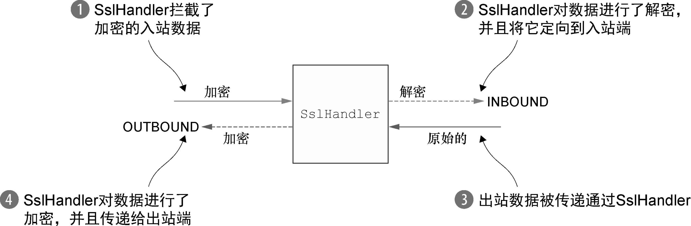
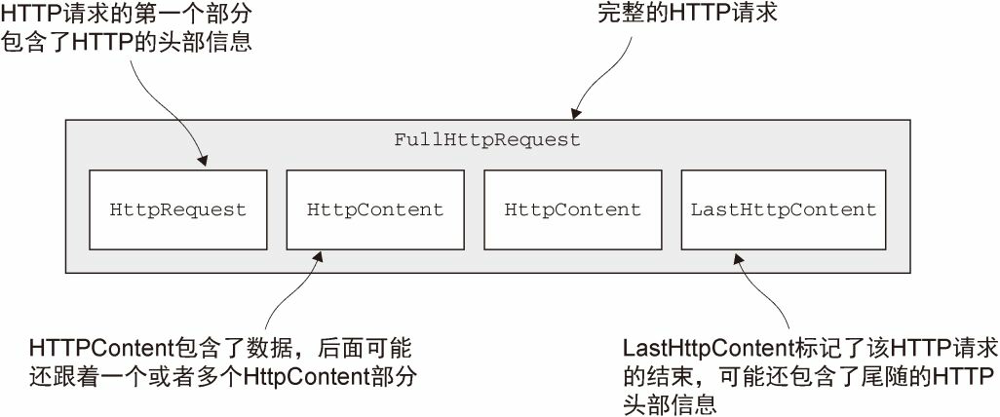
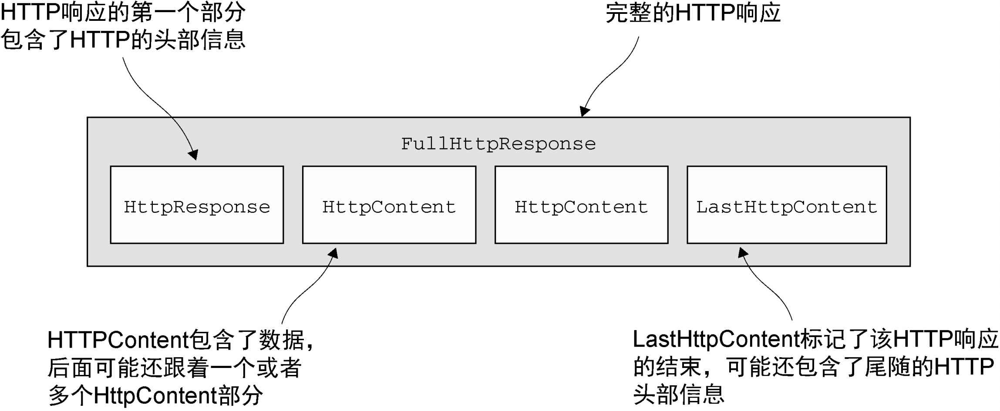
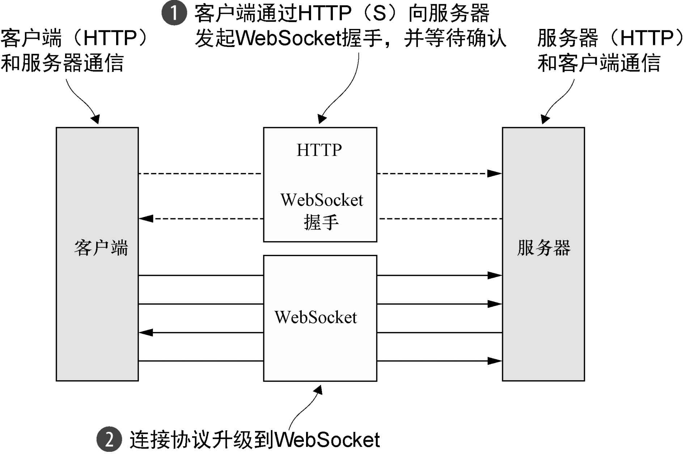
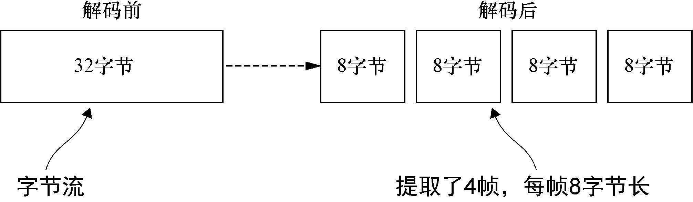
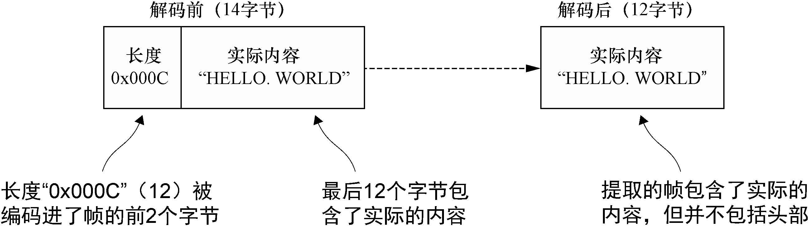

### 通过SSL/TLS保护Netty应用程序 ###

为了支持SSL/TLS，Java提供了`javax.net.ssl`包，它的SSLContext和SSLEngine类使得实现解密和加密相当简单直接。Netty通过一个名为`SslHandler`的ChannelHandler实现利用了这个API，其中SslHandler在内部使用SSLEngine来完成实际的工作。



下列代码展示了如何使用`ChannelInitializer`来将`SslHandler`添加到`ChannelPipeline`中。回想一下，ChannelInitializer用于在Channel注册好时设置ChannelPipeline。

```java
package cn.zifangsky.netty.exercise.chapter11;

import io.netty.channel.Channel;
import io.netty.channel.ChannelInitializer;
import io.netty.handler.ssl.SslContext;
import io.netty.handler.ssl.SslHandler;

import javax.net.ssl.SSLEngine;

/**
 * Adding SSL/TLS support
 *
 * @author zifangsky
 * @date 2020/10/23
 * @since 1.0.0
 */
public class SslChannelInitializer extends ChannelInitializer<Channel> {
    /**
     * 传入要使用的SslContext
     */
    private final SslContext context;
    /**
     * 如果设置为true，第一个写入的消息将不会被加密（客户端应该设置为true）
     */
    private final boolean startTls;

    public SslChannelInitializer(SslContext context, boolean startTls) {
        this.context = context;
        this.startTls = startTls;
    }

    @Override
    protected void initChannel(Channel ch) throws Exception {
        //对于每个SslHandler实例，都使用Channel的ByteBuf-Allocator从SslContext获取一个新的SSLEngine
        SSLEngine engine = context.newEngine(ch.alloc());

        //将SslHandler作为第一个ChannelHandler添加到ChannelPipeline中
        ch.pipeline().addFirst("ssl", new SslHandler(engine, startTls));
    }
}
```

在大多数情况下，SslHandler将是ChannelPipeline中的第一个ChannelHandler。这确保了只有在所有其他的ChannelHandler将它们的逻辑应用到数据之后，才会进行加密。


### 构建基于Netty的HTTP/HTTPS应用程序 ###

接下来，我们来看看Netty提供的ChannelHandler，你可以用它来处理HTTP和HTTPS协议，而不必编写自定义的编解码器。


#### HTTP解码器、编码器和编解码器 ####

HTTP是基于请求/响应模式的：客户端向服务器发送一个HTTP请求，然后服务器将会返回一个HTTP响应。Netty提供了多种编码器和解码器以简化对这个协议的使用。





一个HTTP请求/响应可能由多个数据部分组成，并且它总是以一个LastHttpContent部分作为结束。FullHttpRequest和FullHttpResponse消息是特殊的子类型，分别代表了完整的请求和响应。

下表概要地介绍了处理和生成这些消息的HTTP解码器和编码器。

| 名　　称            | 描　　述                                                   |
| ------------------- | ---------------------------------------------------------- |
| HttpRequestEncoder  | 将HttpRequest、HttpContent和LastHttpContent消息编码为字节  |
| HttpResponseEncoder | 将HttpResponse、HttpContent和LastHttpContent消息编码为字节 |
| HttpRequestDecoder  | 将字节解码为HttpRequest、HttpContent和LastHttpContent消息  |
| HttpResponseDecoder | 将字节解码为HttpResponse、HttpContent和LastHttpContent消息 |

```java
public class HttpPipelineInitializer extends ChannelInitializer<Channel> {
    private final boolean client;

    public HttpPipelineInitializer(boolean client) {
        this.client = client;
    }

    @Override
    protected void initChannel(Channel ch) throws Exception {
        ChannelPipeline pipeline = ch.pipeline();
        if (client) {
            //添加HttpResponseDecoder以处理来自服务器的响应
            pipeline.addLast("decoder", new HttpResponseDecoder());
            //添加HttpRequestEncoder以向服务器发送请求
            pipeline.addLast("encoder", new HttpRequestEncoder());
        } else {
            //添加HttpRequestDecoder以接收来自客户端的请求
            pipeline.addLast("decoder", new HttpRequestDecoder());
            //添加HttpResponseEncoder以向客户端发送响应
            pipeline.addLast("encoder", new HttpResponseEncoder());
        }
    }
}
```


#### 聚合HTTP消息 ####

在ChannelInitializer将ChannelHandler安装到ChannelPipeline中之后，你便可以处理不同类型的HttpObject消息了。但是由于HTTP的请求和响应可能由许多部分组成，因此你需要聚合它们以形成完整的消息。为了消除这项繁琐的任务，Netty提供了一个聚合器，它可以将多个消息部分合并为FullHttpRequest或者FullHttpResponse消息。通过这样的方式，你将总是看到完整的消息内容。

由于消息分段需要被缓冲，直到可以转发一个完整的消息给下一个ChannelInbound-Handler，所以这个操作有轻微的开销。其所带来的好处便是你不必关心消息碎片了。

```java
public class HttpAggregatorInitializer extends ChannelInitializer<Channel> {
    private final boolean client;

    public HttpAggregatorInitializer(boolean client) {
        this.client = client;
    }

    @Override
    protected void initChannel(Channel ch) throws Exception {
        ChannelPipeline pipeline = ch.pipeline();
        if (client) {
            pipeline.addLast("codec", new HttpClientCodec());
        } else {
            pipeline.addLast("codec", new HttpServerCodec());
        }
        //将最大的消息大小为512KB的HttpObjectAggregator添加到ChannelPipeline
        pipeline.addLast("aggregator", new HttpObjectAggregator(512 * 1024));
    }
}
```


#### HTTP压缩 ####

当使用HTTP时，建议开启压缩功能以尽可能多地减小传输数据的大小。虽然压缩会带来一些CPU时钟周期上的开销，但是通常来说它都是一个好主意，特别是对于文本数据来说。Netty为压缩和解压缩提供了ChannelHandler实现，它们同时支持gzip和deflate编码。

```java
public class HttpCompressionInitializer extends ChannelInitializer<Channel> {
    private final boolean client;

    public HttpCompressionInitializer(boolean client) {
        this.client = client;
    }

    @Override
    protected void initChannel(Channel ch) throws Exception {
        ChannelPipeline pipeline = ch.pipeline();
        if (client) {
            pipeline.addLast("codec", new HttpClientCodec());
            //添加HttpContentDecompressor以处理来自服务器的压缩内容
            pipeline.addLast("decompressor", new HttpContentDecompressor());
        } else {
            pipeline.addLast("codec", new HttpServerCodec());
            //添加HttpContentCompressor来压缩数据（如果客户端支持它）
            pipeline.addLast("compressor", new HttpContentDecompressor());
        }
    }
}
```


#### 使用HTTPS ####

启用HTTPS只需要将SslHandler添加到ChannelPipeline的ChannelHandler组合中。

```java
public class HttpsCodecInitializer extends ChannelInitializer<Channel> {
    private final SslContext context;
    private final boolean client;

    public HttpsCodecInitializer(SslContext context, boolean client) {
        this.context = context;
        this.client = client;
    }

    @Override
    protected void initChannel(Channel ch) throws Exception {
        SSLEngine engine = context.newEngine(ch.alloc());
        ChannelPipeline pipeline = ch.pipeline();
        //将SslHandler添加到ChannelPipeline中以使用HTTPS
        pipeline.addFirst("ssl", new SslHandler(engine));
        
        if (client) {
            pipeline.addLast("codec", new HttpClientCodec());
        } else {
            pipeline.addLast("codec", new HttpServerCodec());
        }
    }
}
```


#### WebSocket ####

下图给出了WebSocket协议的一般概念。在这个场景下，通信将作为普通的HTTP协议开始，随后升级到双向的WebSocket协议。



要想向你的应用程序中添加对于WebSocket的支持，你需要将适当的客户端或者服务器WebSocket ChannelHandler添加到ChannelPipeline中。这个类将处理由WebSocket定义的称为帧的特殊消息类型。如下表所示，WebSocketFrame可以被归类为数据帧或者控制帧。

| 名　　称                   | 描　　述                                                     |
| -------------------------- | ------------------------------------------------------------ |
| BinaryWebSocketFrame       | 数据帧：二进制数据                                           |
| TextWebSocketFrame         | 数据帧：文本数据                                             |
| ContinuationWebSocketFrame | 数据帧：属于上一个BinaryWebSocketFrame或者TextWebSocketFrame的文本的或者二进制数据 |
| CloseWebSocketFrame        | 控制帧：一个CLOSE请求、关闭的状态码以及关闭的原因            |
| PingWebSocketFrame         | 控制帧：请求一个PongWebSocketFrame                           |
| PongWebSocketFrame         | 控制帧：对PingWebSocketFrame请求的响应                       |

```java
public class WebSocketServerInitializer extends ChannelInitializer<Channel> {
    @Override
    protected void initChannel(Channel ch) throws Exception {
        ch.pipeline().addLast(
            new HttpServerCodec(),
            new HttpObjectAggregator(65536),
            new WebSocketServerProtocolHandler("/websocket"),
            new TextFrameHandler(),
            new BinaryFrameHandler(),
            new ContinuationFrameHandler());
    }

    public static final class TextFrameHandler extends SimpleChannelInboundHandler<TextWebSocketFrame> {
        @Override
        public void channelRead0(ChannelHandlerContext ctx, TextWebSocketFrame msg) throws Exception {
            // Handle text frame
        }
    }

    public static final class BinaryFrameHandler extends SimpleChannelInboundHandler<BinaryWebSocketFrame> {
        @Override
        public void channelRead0(ChannelHandlerContext ctx, BinaryWebSocketFrame msg) throws Exception {
            // Handle binary frame
        }
    }

    public static final class ContinuationFrameHandler extends SimpleChannelInboundHandler<ContinuationWebSocketFrame> {
        @Override
        public void channelRead0(ChannelHandlerContext ctx, ContinuationWebSocketFrame msg) throws Exception {
            // Handle continuation frame
        }
    }
}
```


### 空闲的连接和超时 ###

检测空闲连接以及超时对于及时释放资源来说是至关重要的。由于这是一项常见的任务，Netty特地为它提供了几个ChannelHandler实现。

| 名　　称            | 描　　述                                                     |
| ------------------- | ------------------------------------------------------------ |
| IdleStateHandler    | 当连接空闲时间太长时，将会触发一个IdleStateEvent事件。然后，你可以通过在你的ChannelInboundHandler中重写userEventTriggered()方法来处理该IdleStateEvent事件 |
| ReadTimeoutHandler  | 如果在指定的时间间隔内没有收到任何的入站数据，则抛出一个ReadTimeoutException并关闭对应的Channel。可以通过重写你的ChannelHandler中的exceptionCaught()方法来检测该ReadTimeoutException |
| WriteTimeoutHandler | 如果在指定的时间间隔内没有任何出站数据写入，则抛出一个WriteTimeoutException并关闭对应的Channel。可以通过重写你的ChannelHandler的exceptionCaught()方法检测该WriteTimeoutException |

让我们仔细看看在实践中使用得最多的IdleStateHandler吧。下列代码展示了当使用通常的发送心跳消息到远程节点的方法时，如果在60秒之内没有接收或者发送任何的数据，我们将如何得到通知；如果没有响应，则连接会被关闭。

```java
public class IdleStateHandlerInitializer extends ChannelInitializer<Channel> {

    @Override
    protected void initChannel(Channel ch) throws Exception {
        ChannelPipeline pipeline = ch.pipeline();
        //IdleStateHandler将在被触发时发送一个IdleStateEvent事件
        pipeline.addLast(new IdleStateHandler(0, 0, 60, TimeUnit.SECONDS));
        //将一个HeartbeatHandler添加到ChannelPipeline中
        pipeline.addLast(new HeartbeatHandler());
    }

    public static final class HeartbeatHandler extends ChannelInboundHandlerAdapter {
        //发送到远程节点的心跳消息
        private static final ByteBuf HEARTBEAT_SEQUENCE = Unpooled.unreleasableBuffer(
                Unpooled.copiedBuffer("HEARTBEAT", CharsetUtil.UTF_8));

        @Override
        public void userEventTriggered(ChannelHandlerContext ctx, Object evt) throws Exception {
            if(evt instanceof IdleStateEvent){
                //发送心跳消息，并在发送失败时关闭该连接
                ctx.writeAndFlush(HEARTBEAT_SEQUENCE.duplicate())
                        .addListener(ChannelFutureListener.CLOSE_ON_FAILURE);
            }else{
                //如果不是IdleStateEvent事件，就将它传递给下一个ChannelInboundHandler
                super.userEventTriggered(ctx, evt);
            }
        }
    }
}
```


### 解码基于分隔符的协议和基于长度的协议 ###

#### 基于分隔符的协议 ####

基于分隔符的（delimited）消息协议使用定义的字符来标记的消息或者消息段（通常被称为帧）的开头或者结尾。由RFC文档正式定义的许多协议（如SMTP、POP3、IMAP以及Telnet）都是这样的。此外，当然，私有组织通常也拥有他们自己的专有格式。无论你使用什么样的协议，下表中列出的解码器都能帮助你定义可以提取由任意标记（token）序列分隔的帧的自定义解码器。

| 名　　称                   | 描　　述                                                     |
| -------------------------- | ------------------------------------------------------------ |
| DelimiterBasedFrameDecoder | 使用任何由用户提供的分隔符来提取帧的通用解码器               |
| LineBasedFrameDecoder      | 提取由行尾符（\n或者\r\n）分隔的帧的解码器。这个解码器比DelimiterBasedFrameDecoder更快 |

```java
public class LineBasedHandlerInitializer extends ChannelInitializer<Channel> {

    @Override
    protected void initChannel(Channel ch) throws Exception {
        ChannelPipeline pipeline = ch.pipeline();
        
        //该LineBasedFrameDecoder将提取的帧转发给下一个ChannelInboundHandler
        pipeline.addLast(new LineBasedFrameDecoder(64 * 1024));
        //添加FrameHandler以接收帧
        pipeline.addLast(new FrameHandler());
    }

    public static final class FrameHandler extends SimpleChannelInboundHandler<ByteBuf> {

        @Override
        public void channelRead0(ChannelHandlerContext ctx, ByteBuf msg) throws Exception {
            // Do something with the data extracted from the frame
        }
    }
}
```


#### 基于长度的协议 ####

基于长度的协议通过将它的长度编码到帧的头部来定义帧，而不是使用特殊的分隔符来标记它的结束。下表列出了Netty提供的用于处理这种类型的协议的两种解码器。

| 名　　称                     | 描　　述                                                     |
| ---------------------------- | ------------------------------------------------------------ |
| FixedLengthFrameDecoder      | 提取在调用构造函数时指定的定长帧                             |
| LengthFieldBasedFrameDecoder | 根据编码进帧头部中的长度值提取帧；该字段的偏移量以及长度在构造函数中指定 |

下图展示了`FixedLengthFrameDecoder`的功能，其在构造时已经指定了帧长度为8字节。



你将经常会遇到被编码到消息头部的帧大小不是固定值的协议。为了处理这种变长帧，你可以使用`LengthFieldBasedFrameDecoder`，它将从头部字段确定帧长，然后从数据流中提取指定的字节数。

下图展示了一个示例，其中长度字段在帧中的偏移量为0，并且长度为2字节。



LengthFieldBasedFrameDecoder提供了几个构造函数来支持各种各样的头部配置情况。下列代码展示了如何使用其3个构造参数分别为maxFrameLength、lengthField-Offset和lengthFieldLength的构造函数。在这个场景中，帧的长度被编码到了帧起始的前8个字节中。

```java
public class LengthBasedInitializer extends ChannelInitializer<Channel> {

    @Override
    protected void initChannel(Channel ch) throws Exception {
        ChannelPipeline pipeline = ch.pipeline();
        
        //使用LengthFieldBasedFrameDecoder解码将帧长度编码到帧起始的前8个字节中的消息
        pipeline.addLast(new LengthFieldBasedFrameDecoder(64 * 1024, 0, 8));
        //添加FrameHandler以处理每个帧
        pipeline.addLast(new FrameHandler());
    }

    public static final class FrameHandler extends SimpleChannelInboundHandler<ByteBuf> {
        
        @Override
        public void channelRead0(ChannelHandlerContext ctx,
                                 ByteBuf msg) throws Exception {
            // Do something with the frame
        }
    }
}
```


### 写大型数据 ###

在我们讨论传输的过程中，提到了NIO的零拷贝特性，这种特性消除了将文件的内容从文件系统移动到网络栈的复制过程。所有的这一切都发生在Netty的核心中，所以应用程序所有需要做的就是使用一个`FileRegion`接口的实现，其在Netty的API文档中的定义是：“**通过支持零拷贝的文件传输的Channel来发送的文件区域**。”

下列代码展示了如何通过从FileInputStream创建一个DefaultFileRegion，并将其写入Channe，从而利用零拷贝特性来传输一个文件的内容。

```java
public class FileRegionWriteHandler extends ChannelInboundHandlerAdapter {
    private static final Channel CHANNEL_FROM_SOMEWHERE = new NioSocketChannel();
    private static final File FILE_FROM_SOMEWHERE = new File("");

    @Override
    public void channelActive(ChannelHandlerContext ctx) throws Exception {
        File file = FILE_FROM_SOMEWHERE;
        Channel channel = CHANNEL_FROM_SOMEWHERE;

        FileInputStream in = new FileInputStream(file);
        //以该文件的完整长度创建一个新的DefaultFileRegion
        FileRegion region = new DefaultFileRegion(in.getChannel(), 0, file.length());

        //发送该DefaultFileRegion，并注册一个ChannelFutureListener
        channel.writeAndFlush(region).addListener(future -> {
            if (!future.isSuccess()) {
                //处理失败情况
                Throwable cause = future.cause();
                // Do something
            }
        });
    }
}
```

这个示例只适用于文件内容的直接传输，不包括应用程序对数据的任何处理。在需要将数据从文件系统复制到用户内存中时，可以使用ChunkedWriteHandler，它支持异步写大型数据流，而又不会导致大量的内存消耗。

关键是`interface ChunkedInput\<B\>`，其中类型参数B是readChunk()方法返回的类型。Netty预置了该接口的4个实现，如下表中所列出的。每个都代表了一个将由`ChunkedWriteHandler`处理的不定长度的数据流。

ChunkedInput的实现：

| 名　　称         | 描　　述                                                     |
| ---------------- | ------------------------------------------------------------ |
| ChunkedFile      | 从文件中逐块获取数据，当你的平台不支持零拷贝或者你需要转换数据时使用 |
| ChunkedNioFile   | 和ChunkedFile类似，只是它使用了FileChannel                   |
| ChunkedStream    | 从InputStream中逐块传输内容                                  |
| ChunkedNioStream | 从ReadableByteChannel中逐块传输内容                          |

```java
public class ChunkedWriteHandlerInitializer extends ChannelInitializer<Channel> {
    private final File file;
    private final SslContext sslCtx;

    public ChunkedWriteHandlerInitializer(File file, SslContext sslCtx) {
        this.file = file;
        this.sslCtx = sslCtx;
    }

    @Override
    protected void initChannel(Channel ch) throws Exception {
        ChannelPipeline pipeline = ch.pipeline();

        //将SslHandler添加到ChannelPipeline中
        pipeline.addLast(new SslHandler(sslCtx.newEngine(ch.alloc())));
        //添加ChunkedWriteHandler以处理作为ChunkedInput传入的数据
        pipeline.addLast(new ChunkedWriteHandler());
        //一旦连接建立，WriteStreamHandler就开始写文件数据
        pipeline.addLast(new WriteStreamHandler());
    }

    public final class WriteStreamHandler extends ChannelInboundHandlerAdapter {
        /**
         * 当连接建立时，channelActive()方法将使用ChunkedInput写文件数据
         */
        @Override
        public void channelActive(ChannelHandlerContext ctx) throws Exception {
            super.channelActive(ctx);
            ctx.writeAndFlush(new ChunkedStream(new FileInputStream(file)));
        }
    }
}
```


### 序列化数据 ###

#### JDK序列化 ####

如果你的应用程序必须要和使用了`ObjectOutputStream`和`ObjectInputStream`的远程节点交互，并且兼容性也是你最关心的，那么JDK序列化将是正确的选择。下表中列出了Netty提供的用于和JDK进行互操作的序列化类。

| 名　　称                | 描　　述                                                     |
| ----------------------- | ------------------------------------------------------------ |
| CompatibleObjectDecoder | 和使用JDK序列化的非基于Netty的远程节点进行互操作的解码器     |
| CompatibleObjectEncoder | 和使用JDK序列化的非基于Netty的远程节点进行互操作的编码器     |
| ObjectDecoder           | 构建于JDK序列化之上的使用自定义的序列化来解码的解码器；当没有其他的外部依赖时，它提供了速度上的改进。否则其他的序列化实现更加可取 |
| ObjectEncoder           | 构建于JDK序列化之上的使用自定义的序列化来编码的编码器；当没有其他的外部依赖时，它提供了速度上的改进。否则其他的序列化实现更加可取 |


#### 通过Protocol Buffers序列化 ####

Protocol Buffers以一种紧凑而高效的方式对结构化的数据进行编码以及解码。它具有许多的编程语言绑定，使得它很适合跨语言的项目。下表展示了Netty为支持protobuf所提供的ChannelHandler实现。

| 名　　称                             | 描　　述                                                     |
| ------------------------------------ | ------------------------------------------------------------ |
| ProtobufDecoder                      | 使用protobuf对消息进行解码                                   |
| ProtobufEncoder                      | 使用protobuf对消息进行编码                                   |
| ProtobufVarint32FrameDecoder         | 根据消息中的Google Protocol Buffers的“Base 128 Varints”整型长度字段值动态地分割所接收到的ByteBuf |
| ProtobufVarint32LengthFieldPrepender | 向ByteBuf前追加一个Google Protocal Buffers的“Base 128 Varints”整型的长度字段值 |

```java
public class ProtoBufInitializer extends ChannelInitializer<Channel> {
    private final MessageLite lite;

    public ProtoBufInitializer(MessageLite lite) {
        this.lite = lite;
    }

    @Override
    protected void initChannel(Channel ch) throws Exception {
        ChannelPipeline pipeline = ch.pipeline();

        //添加ProtobufVarint32FrameDecoder以分隔帧
        pipeline.addLast(new ProtobufVarint32FrameDecoder());
        //添加ProtobufEncoder以处理消息的编码
        pipeline.addLast(new ProtobufEncoder());
        //添加ProtobufDecoder以解码消息
        pipeline.addLast(new ProtobufDecoder(lite));
        //添加ObjectHandler以处理解码消息
        pipeline.addLast(new ObjectHandler());
    }

    public static final class ObjectHandler extends SimpleChannelInboundHandler<Object> {

        @Override
        public void channelRead0(ChannelHandlerContext ctx, Object msg)
            throws Exception {
            // Do something with the object
        }
    }
}
```

