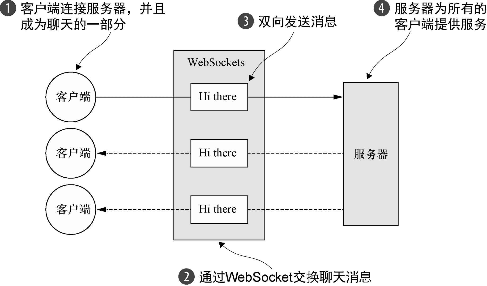
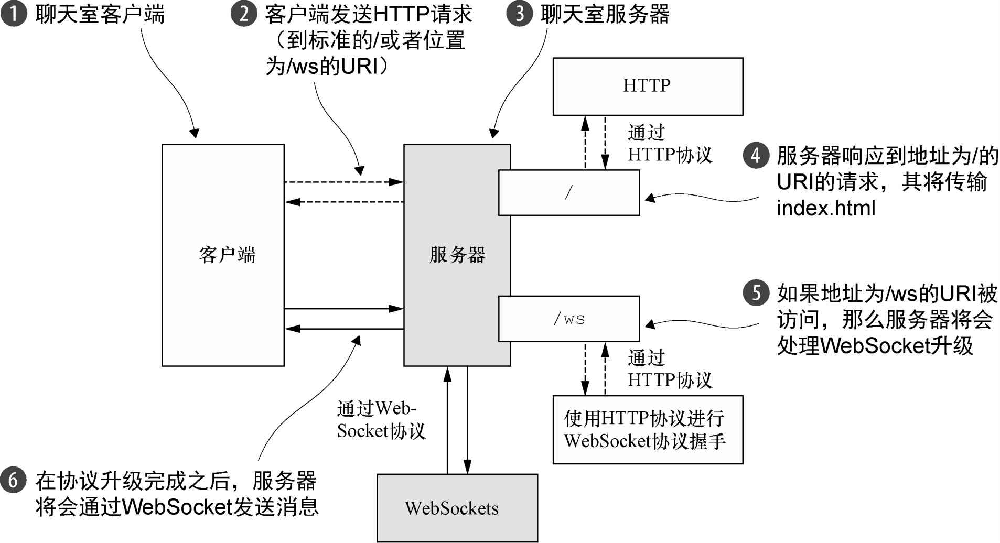
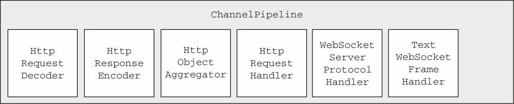
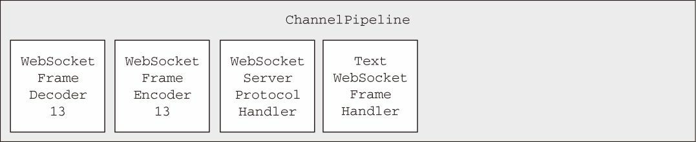

### 添加WebSocket支持 ###

在从标准的HTTP或者HTTPS协议切换到WebSocket时，将会使用一种称为升级握手的机制。因此，使用WebSocket的应用程序将始终以HTTP/S作为开始，然后再执行升级。这个升级动作发生的确切时刻特定于应用程序；它可能会发生在启动时，也可能会发生在请求了某个特定的URL之后。

我们的应用程序将采用下面的约定：如果被请求的URL以`/ws`结尾，那么我们将会把该协议升级为WebSocket；否则，服务器将使用基本的HTTP/S。在连接已经升级完成之后，所有数据都将会使用WebSocket进行传输。

下图说明了该服务器逻辑，一如在Netty中一样，它由一组ChannelHandler实现。我们将会在下一节中，解释用于处理HTTP以及WebSocket协议的技术时，描述它们。



#### 处理HTTP请求 ####

首先，我们将实现该处理HTTP请求的组件。这个组件将提供用于访问聊天室并显示由连接的客户端发送的消息的网页。下列代码给出了这个HttpRequestHandler对应的代码，其扩展了SimpleChannelInboundHandler以处理FullHttpRequest消息。需要注意的是，channelRead0()方法的实现是如何转发任何目标URI为/ws的请求的。

```java
package cn.zifangsky.netty.exercise.chapter12;

import io.netty.channel.*;
import io.netty.handler.codec.http.*;
import io.netty.handler.ssl.SslHandler;
import io.netty.handler.stream.ChunkedNioFile;
import lombok.extern.slf4j.Slf4j;

import java.io.File;
import java.io.RandomAccessFile;
import java.net.URISyntaxException;
import java.net.URL;

/**
 * 处理 HTTP/S 请求
 *
 * @author zifangsky
 * @date 2020/10/26
 * @since 1.0.0
 */
@Slf4j
public class HttpRequestHandler extends SimpleChannelInboundHandler<FullHttpRequest> {
    private final String wsUri;
    private static final File INDEX;

    static {
        //加载首页所在路径
        URL location = HttpRequestHandler.class.getResource("/index.html");
        try {
            String path = location.toURI().getPath();
            INDEX = new File(path);
        } catch (URISyntaxException e) {
            throw new IllegalStateException("Unable to locate index.html", e);
        }
    }

    public HttpRequestHandler(String wsUri) {
        this.wsUri = wsUri;
    }

    @Override
    protected void channelRead0(ChannelHandlerContext ctx, FullHttpRequest request) throws Exception {
        //如果请求了WebSocket协议升级，则增加引用计数（调用retain()方法），并将它传递给下一个ChannelInboundHandler
        if(wsUri.equalsIgnoreCase(request.uri())){
            ctx.fireChannelRead(request.retain());
        }else{
            //处理100 Continue请求以符合HTTP1.1规范
            if(HttpUtil.is100ContinueExpected(request)){
                this.send100Continue(ctx);
            }

            //读取index.html
            RandomAccessFile file = new RandomAccessFile(INDEX, "r");
            HttpResponse response = new DefaultHttpResponse(request.protocolVersion(), HttpResponseStatus.OK);
            response.headers().set(HttpHeaderNames.CONTENT_TYPE, "text/html; charset=UTF-8");

            //如果请求了keep-alive，则添加所需要的HTTP头信息
            boolean keepAlive = HttpUtil.isKeepAlive(request);
            if(keepAlive){
                response.headers().set(HttpHeaderNames.CONTENT_LENGTH, file.length());
                response.headers().set(HttpHeaderNames.CONNECTION, HttpHeaderValues.KEEP_ALIVE);
            }

            //将HttpResponse写到客户端
            ctx.write(response);
            //将index.html写到客户端
            if(ctx.pipeline().get(SslHandler.class) == null){
                ctx.write(new DefaultFileRegion(file.getChannel(), 0, file.length()));
            }else{
                ctx.write(new ChunkedNioFile(file.getChannel()));
            }

            //写LastHttpContent并冲刷至客户端
            ChannelFuture future = ctx.writeAndFlush(LastHttpContent.EMPTY_LAST_CONTENT);
            //如果没有请求keep-alive，则在写操作完成后关闭Channel
            if(!keepAlive){
                future.addListener(ChannelFutureListener.CLOSE);
            }
        }
    }

    private void send100Continue(ChannelHandlerContext ctx) {
        FullHttpResponse response = new DefaultFullHttpResponse(HttpVersion.HTTP_1_1, HttpResponseStatus.CONTINUE);
        ctx.writeAndFlush(response);
    }
    @Override
    public void exceptionCaught(ChannelHandlerContext ctx, Throwable cause) throws Exception {
        //打印日志
        log.error("数据处理过程中发生异常！", cause);
        //关闭连接
        ctx.close();
    }
}
```


#### 处理WebSocket帧 ####

由IETF发布的WebSocket RFC，定义了6种帧，Netty为它们每种都提供了一个POJO实现。下表列出了这些帧类型，并描述了它们的用法。

| 名　　称                   | 描　　述                                                     |
| -------------------------- | ------------------------------------------------------------ |
| BinaryWebSocketFrame       | 数据帧：二进制数据                                           |
| TextWebSocketFrame         | 数据帧：文本数据                                             |
| ContinuationWebSocketFrame | 数据帧：包含属于上一个BinaryWebSocketFrame或者TextWebSocketFrame的二进制数据或者文本数据 |
| CloseWebSocketFrame        | 控制帧：表示一个CLOSE请求，包含一个关闭的状态码和关闭的原因  |
| PingWebSocketFrame         | 控制帧：请求传输一个PongWebSocketFrame                       |
| PongWebSocketFrame         | 控制帧：对PingWebSocketFrame请求的响应                       |

我们的聊天应用程序将使用下面几种帧类型：

- CloseWebSocketFrame；
- PingWebSocketFrame；
- PongWebSocketFrame；
- TextWebSocketFrame。

TextWebSocketFrame是我们唯一真正需要处理的帧类型。为了符合WebSocket RFC，Netty提供了WebSocketServerProtocolHandler来处理其他类型的帧。

```java
package cn.zifangsky.netty.exercise.chapter12;

import io.netty.buffer.Unpooled;
import io.netty.channel.ChannelHandlerContext;
import io.netty.channel.SimpleChannelInboundHandler;
import io.netty.channel.group.ChannelGroup;
import io.netty.handler.codec.http.websocketx.TextWebSocketFrame;
import io.netty.handler.codec.http.websocketx.WebSocketServerProtocolHandler;
import io.netty.util.CharsetUtil;

/**
 * 处理文本帧
 *
 * @author zifangsky
 * @date 2020/10/26
 * @since 1.0.0
 */
public class TextWebSocketFrameHandler extends SimpleChannelInboundHandler<TextWebSocketFrame> {
    private final ChannelGroup group;

    public TextWebSocketFrameHandler(ChannelGroup group) {
        this.group = group;
    }

    /**
     * 重写{@link io.netty.channel.ChannelInboundHandlerAdapter#userEventTriggered(ChannelHandlerContext, Object)}方法以处理自定义事件
     */
    @Override
    public void userEventTriggered(ChannelHandlerContext ctx, Object evt) throws Exception {
        if(evt instanceof WebSocketServerProtocolHandler.HandshakeComplete){
            //如果该事件表示握手成功，则从该ChannelPipeline中移除HttpRequestHandler，因为将不会接收到任何HTTP消息了
            ctx.pipeline().remove(HttpRequestHandler.class);

            //通知所有已经连接的WebSocket客户端新的客户端已经连接上了
            this.group.writeAndFlush(new TextWebSocketFrame("Client " + ctx.channel().id() + " joined!"));
            //将新的WebSocket Channel添加到ChannelGroup中，以便它可以接收到所有消息
            this.group.add(ctx.channel());
        }else{
            super.userEventTriggered(ctx, evt);
        }
    }

    @Override
    protected void channelRead0(ChannelHandlerContext ctx, TextWebSocketFrame msg) throws Exception {
        //增加消息的引用计数，并将它写到ChannelGroup 中所有已经连接的客户端
        String resMsg = String.format("[%s] say: %s", ctx.channel().id(), msg.text());
        msg = msg.replace(Unpooled.copiedBuffer(resMsg, CharsetUtil.UTF_8));

        this.group.writeAndFlush(msg.retain());
    }
}
```

和之前一样，对于retain()方法的调用是必需的，因为当channelRead0()方法返回时，TextWebSocketFrame的引用计数将会被减少。由于所有的操作都是异步的，因此，writeAndFlush()方法可能会在channelRead0()方法返回之后完成，而且它绝对不能访问一个已经失效的引用。


#### 初始化ChannelPipeline ####

正如你已经学习到的，为了将ChannelHandler安装到ChannelPipeline中，你扩展了ChannelInitializer，并实现了initChannel()方法。下列代码展示了由此生成的ChatServerInitializer的代码。

```java
package cn.zifangsky.netty.exercise.chapter12;

import io.netty.channel.Channel;
import io.netty.channel.ChannelInitializer;
import io.netty.channel.ChannelPipeline;
import io.netty.channel.group.ChannelGroup;
import io.netty.handler.codec.http.HttpObjectAggregator;
import io.netty.handler.codec.http.HttpServerCodec;
import io.netty.handler.codec.http.websocketx.WebSocketServerProtocolHandler;
import io.netty.handler.stream.ChunkedWriteHandler;

/**
 * 初始化ChannelPipeline
 *
 * @author zifangsky
 * @date 2020/10/26
 * @since 1.0.0
 */
public class ChatServerInitializer extends ChannelInitializer<Channel> {
    private final ChannelGroup group;

    public ChatServerInitializer(ChannelGroup group) {
        this.group = group;
    }

    @Override
    protected void initChannel(Channel ch) throws Exception {
        ChannelPipeline pipeline = ch.pipeline();
        pipeline.addLast(new HttpServerCodec());
        pipeline.addLast(new ChunkedWriteHandler());
        pipeline.addLast(new HttpObjectAggregator(64 * 1024));
        pipeline.addLast(new HttpRequestHandler("/ws"));
        pipeline.addLast(new WebSocketServerProtocolHandler("/ws"));
        pipeline.addLast(new TextWebSocketFrameHandler(group));
    }
}
```

对于initChannel()方法的调用，通过安装所有必需的ChannelHandler来设置该新注册的Channel的ChannelPipeline。这些ChannelHandler以及它们各自的职责都被总结在了下表中。

| ChannelHandler                 | 职　　责                                                     |
| ------------------------------ | ------------------------------------------------------------ |
| HttpServerCodec                | 将字节解码为`HttpRequest`、`HttpContent`和`LastHttpContent`。并将`HttpRequest`、`HttpContent`和`LastHttpContent`编码为字节 |
| ChunkedWriteHandler            | 写入一个文件的内容                                           |
| HttpObjectAggregator           | 将一个HttpMessage和跟随它的多个HttpContent聚合为单个FullHttpRequest或者FullHttpResponse（取决于它是被用来处理请求还是响应）。安装了这个之后，ChannelPipeline中的下一个ChannelHandler将只会收到完整的HTTP请求或响应 |
| HttpRequestHandler             | 处理FullHttpRequest（那些不发送到/ws URI的请求）             |
| WebSocketServerProtocolHandler | 按照WebSocket规范的要求，处理WebSocket升级握手、PingWebSocketFrame、PongWebSocketFrame和CloseWebSocketFrame |
| TextWebSocketFrameHandler      | 处理TextWebSocketFrame和握手完成事件                         |

Netty的WebSocketServerProtocolHandler处理了所有委托管理的WebSocket帧类型以及升级握手本身。如果握手成功，那么所需的ChannelHandler将会被添加到ChannelPipeline中，而那些不再需要的ChannelHandler则将会被移除。

WebSocket协议升级之前的ChannelPipeline的状态如下图所示。这代表了刚刚被ChatServerInitializer初始化之后的ChannelPipeline。



当WebSocket协议升级完成之后，WebSocketServerProtocolHandler将会把Http-RequestDecoder替换为WebSocketFrameDecoder，把HttpResponseEncoder替换为WebSocketFrameEncoder。为了性能最大化，它将移除任何不再被WebSocket连接所需要的ChannelHandler。

下图展示了这些操作完成之后的ChannelPipeline。需要注意的是，Netty目前支持4个版本的WebSocket协议，它们每个都具有自己的实现类。Netty将会根据客户端（这里指浏览器）所支持的版本，自动地选择正确版本的WebSocketFrameDecoder和WebSocket-FrameEncoder。




#### 引导 ####

```java
package cn.zifangsky.netty.exercise.chapter12;

import io.netty.bootstrap.ServerBootstrap;
import io.netty.channel.Channel;
import io.netty.channel.ChannelFuture;
import io.netty.channel.ChannelInitializer;
import io.netty.channel.EventLoopGroup;
import io.netty.channel.group.ChannelGroup;
import io.netty.channel.group.DefaultChannelGroup;
import io.netty.channel.nio.NioEventLoopGroup;
import io.netty.channel.socket.nio.NioServerSocketChannel;
import io.netty.util.concurrent.ImmediateEventExecutor;
import lombok.extern.slf4j.Slf4j;

import java.net.InetSocketAddress;

/**
 * 引导服务端
 *
 * @author zifangsky
 * @date 2020/10/26
 * @since 1.0.0
 */
@Slf4j
public class ChatServer {
    private final ChannelGroup channelGroup = new DefaultChannelGroup(ImmediateEventExecutor.INSTANCE);
    private final EventLoopGroup group = new NioEventLoopGroup();
    private Channel channel;

    public ChannelFuture start(int port){
        ServerBootstrap bootstrap = new ServerBootstrap();

        bootstrap.group(this.group)
                .channel(NioServerSocketChannel.class)
                .localAddress(new InetSocketAddress(port))
                .childHandler(this.createInitializer(this.channelGroup));

        ChannelFuture future = bootstrap.bind();
        future.syncUninterruptibly();

        this.channel = future.channel();
        return future;
    }

    protected ChannelInitializer<Channel> createInitializer(ChannelGroup group) {
        return new ChatServerInitializer(group);
    }

    public void destroy() {
        if (this.channel != null) {
            this.channel.close();
        }
        this.channelGroup.close();
        this.group.shutdownGracefully();
    }

    public static void main(String[] args) throws Exception {
        if (args.length != 1) {
            System.err.println("Please give port as argument");
            System.exit(1);
        }
        int port = Integer.parseInt(args[0]);

        final ChatServer endpoint = new ChatServer();
        ChannelFuture future = endpoint.start(port);

        Runtime.getRuntime().addShutdownHook(new Thread(endpoint::destroy));
        future.channel().closeFuture().syncUninterruptibly();
    }

}
```


#### 页面 ####

```html
<!doctype html>
<head>
    <meta charset="utf-8">

    <!-- Always force latest IE rendering engine (even in intranet) & Chrome Frame
         Remove this if you use the .htaccess -->
    <meta http-equiv="X-UA-Compatible" content="IE=edge,chrome=1">

    <title>WebSocket ChatServer</title>
    <style type="text/css">
        #ui * {
            width: 100%;
        }

        #ui textarea {
            height: 15em;
        }
    </style>
    <script src="https://cdn.bootcdn.net/ajax/libs/jquery/1.10.0/jquery.min.js"></script>
    <script type="text/javascript">
        function log(msg) {
            var log = $('#log')
            log.append(msg + " \n").scrollTop(log[0].scrollHeight - log.height());
        }
        $(function () {
            $('#url').val((location.protocol.indexOf('https') == -1 ? 'ws://' : 'wss://') + location.host + '/ws')

            if (!WebSocket) {
                $('#not-supported').show()
            } else {
                var ws = null
                $('#connect').click(function () {
                    if (ws == null || ws.readyState != 1) {
                        ws = new WebSocket($('#url').val());

                        ws.onerror = function (e) {
                            log('Error : ' + e.message)
                        };

                        ws.onopen = function () {
                            log('connected')
                        };

                        ws.onclose = function () {
                            log('disconnected')
                        };

                        ws.onmessage = function (d) {
                            log(d.data)
                        };

                        $('#send').click(function () {
                            var msg = $('#msg').val();
                            $('#msg').val('');
                            ws.send(msg);
                            // if (ws.send(msg)) {
                            //     log('Message sent');
                            // } else {
                            //     log('Message not sent');
                            // }
                        })

                    } else {
                        log('closing connection');
                        ws.close()
                    }
                })
            }
        })
    </script>
</head>

<body>

<div id="not-supported" style="float: left; width: 600px; margin-left: 10px; display: none">
    <p>Uh-oh, the browser you're using doesn't have native support for WebSocket. That means you can't run this
        demo.</p>

    <p>The following link lists the browsers that support WebSocket:</p>

    <p><a href="http://caniuse.com/#feat=websockets">http://caniuse.com/#feat=websockets</a></p>
</div>

<table>
    <tr>
        <td>
            <div>Enter a message below to send</div>
            <input type="text" id="msg"/>
            <input type="submit" value="Send" id="send"/>
        </td>
        <td id="ui">
            <input type="text" id="url"/>
            <textarea id="log" disabled></textarea>
            <input type="submit" id="connect" value="Connect"/>
        </td>
    </tr>
</table>
<div style="float: left; width: 600px; margin-left: 10px;">
    <p><br><strong>Instructions:</strong></p>
    <table class="instructions" cellspacing="0px" cellpadding="2px">
        <tr>
            <td valign="top" nowrap>Step 1: &nbsp;</td>
            <td valign="top">Press the <strong>Connect</strong> button.</td>
        </tr>
        <tr>
            <td valign="top" nowrap>Step 2: &nbsp;</td>
            <td valign="top">Once connected, enter a message and press the <strong>Send</strong> button. The server's
                response will
                appear in the <strong>Log</strong> section. You can send as many messages as you like
            </td>
        </tr>
    </table>
</div>
</body>

</html>
```


### 如何进行加密 ###

在真实世界的场景中，你将很快就会被要求向该服务器添加加密。使用Netty，这不过是将一个SslHandler添加到ChannelPipeline中，并配置它的问题。

```java
package cn.zifangsky.netty.exercise.chapter12;

import io.netty.channel.Channel;
import io.netty.channel.group.ChannelGroup;
import io.netty.handler.ssl.SslContext;
import io.netty.handler.ssl.SslHandler;

import javax.net.ssl.SSLEngine;

/**
 * 数据解密传输
 *
 * @author zifangsky
 * @date 2020/10/26
 * @since 1.0.0
 */
public class SecureChatServerInitializer extends ChatServerInitializer {
    private final SslContext context;

    public SecureChatServerInitializer(ChannelGroup group, SslContext context) {
        super(group);
        this.context = context;
    }

    @Override
    protected void initChannel(Channel ch) throws Exception {
        //调用父类的initChannel()方法
        super.initChannel(ch);
        
        SSLEngine engine = context.newEngine(ch.alloc());
        engine.setUseClientMode(false);
        //将SslHandler添加到ChannelPipeline中
        ch.pipeline().addFirst(new SslHandler(engine));
    }
}
```

最后一步是调整`ChatServer`以使用`SecureChatServerInitializer`，以便在`ChannelPipeline`中安装`SslHandler`。

```java
package cn.zifangsky.netty.exercise.chapter12;

import io.netty.channel.Channel;
import io.netty.channel.ChannelFuture;
import io.netty.channel.ChannelInitializer;
import io.netty.channel.group.ChannelGroup;
import io.netty.handler.ssl.SslContext;
import io.netty.handler.ssl.SslContextBuilder;
import io.netty.handler.ssl.util.SelfSignedCertificate;

/**
 * 带加密的引导服务端
 *
 * @author zifangsky
 * @date 2020/10/26
 * @since 1.0.0
 */
public class SecureChatServer extends ChatServer {
    private final SslContext context;

    public SecureChatServer(SslContext context) {
        this.context = context;
    }

    @Override
    protected ChannelInitializer<Channel> createInitializer(ChannelGroup group) {
        return new SecureChatServerInitializer(group, context);
    }

    public static void main(String[] args) throws Exception {
        if (args.length != 1) {
            System.err.println("Please give port as argument");
            System.exit(1);
        }
        int port = Integer.parseInt(args[0]);
        SelfSignedCertificate cert = new SelfSignedCertificate();
        SslContext context = SslContextBuilder.forServer(cert.certificate(), cert.privateKey()).build();

        final SecureChatServer endpoint = new SecureChatServer(context);
        ChannelFuture future = endpoint.start(port);

        Runtime.getRuntime().addShutdownHook(new Thread(endpoint::destroy));
        future.channel().closeFuture().syncUninterruptibly();
    }
}
```

