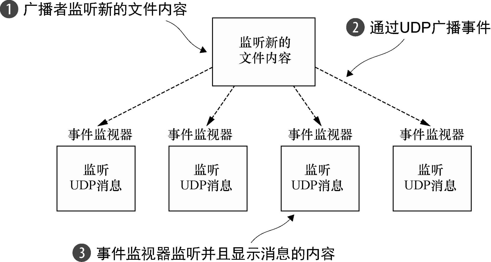
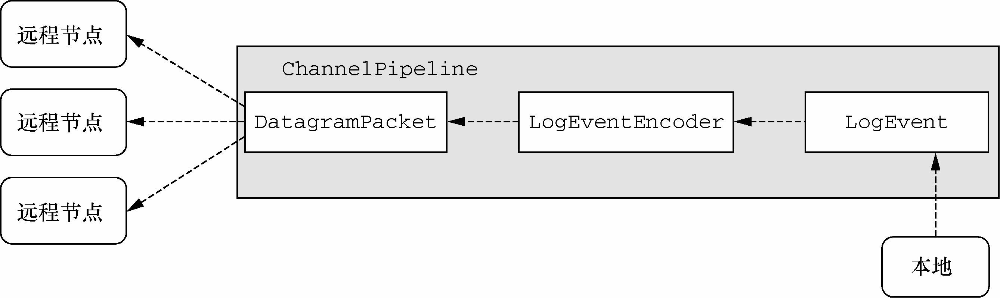
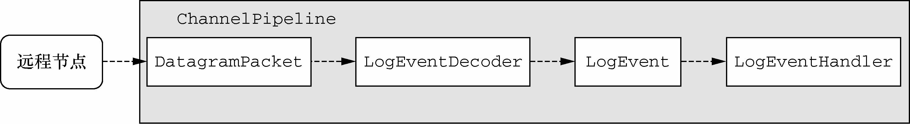
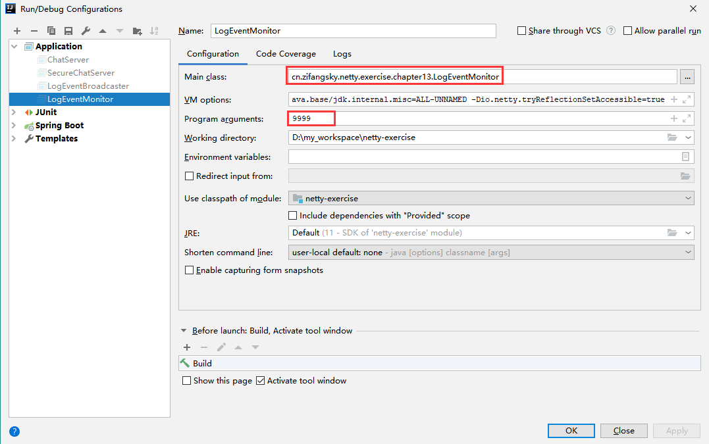
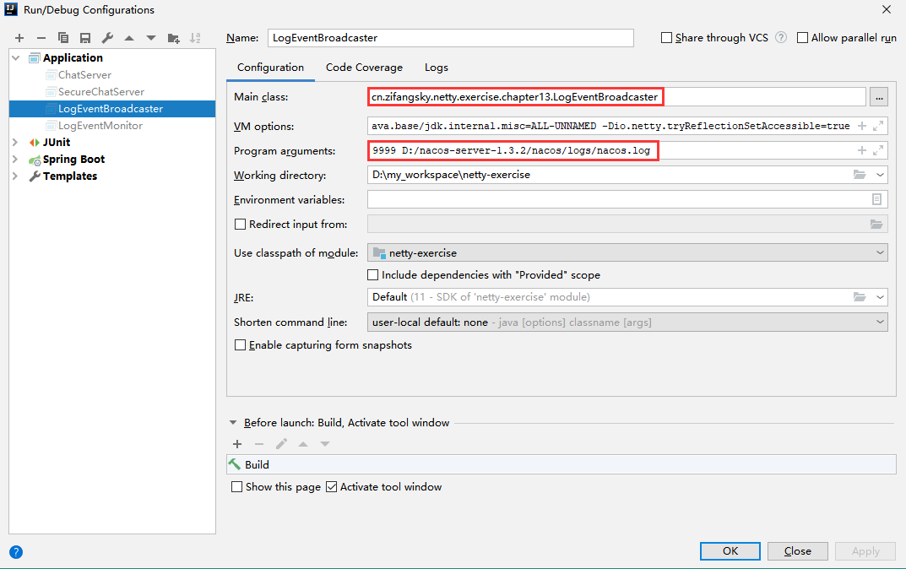

### UDP的基础知识 ###

通过类比，TCP连接就像打电话，其中一系列的有序消息将会在两个方向上流动。相反，UDP则类似于往邮箱中投入一叠明信片。你无法知道它们将以何种顺序到达它们的目的地，或者它们是否所有的都能够到达它们的目的地。

UDP的这些方面可能会让你感觉到严重的局限性，但是它们也解释了为何它会比TCP快那么多：所有的握手以及消息管理机制的开销都已经被消除了。显然，UDP很适合那些能够处理或者容忍消息丢失的应用程序，但可能不适合那些处理金融交易的应用程序。


### UDP广播 ###

UDP提供了向多个接收者发送消息的额外传输模式：

- 多播——传输到一个预定义的主机组；
- 广播——传输到网络（或者子网）上的所有主机。

本章中的示例应用程序将通过发送能够被同一个网络中的所有主机所接收的消息来演示UDP广播的使用。为此，我们将使用特殊的受限广播地址或者零网络地址255.255.255.255。发送到这个地址的消息都将会被定向给本地网络（0.0.0.0）上的所有主机，而不会被路由器转发给其他的网络。


### UDP示例应用程序 ###

我们的示例程序将打开一个文件，随后将会通过UDP把每一行都作为一个消息广播到一个指定的端口。如果你熟悉类UNIX操作系统，你可能会认识到这是标准的syslog实用程序的一个非常简化的版本。UDP非常适合于这样的应用程序，因为考虑到日志文件本身已经被存储在了文件系统中，因此，偶尔丢失日志文件中的一两行是可以容忍的。此外，该应用程序还提供了极具价值的高效处理大量数据的能力。

接收方是怎么样的呢？通过UDP广播，只需简单地通过在指定的端口上启动一个监听程序，便可以创建一个事件监视器来接收日志消息。需要注意的是，这样的轻松访问性也带来了潜在的安全隐患，这也就是为何在不安全的环境中并不倾向于使用UDP广播的原因之一。出于同样的原因，路由器通常也会阻止广播消息，并将它们限制在它们的来源网络上。

下图展示了整个系统的一个高级别视图，其由一个广播者以及一个或者多个事件监视器所组成。广播者将监听新内容的出现，当它出现时，则通过UDP将它作为一个广播消息进行传输。




### 消息POJO: LogEvent ###

```java
@Getter
public final class LogEvent {
    public static final byte SEPARATOR = (byte) ':';
    /**
     * 消息来源
     */
    private final InetSocketAddress sourceAddress;
    /**
     * 日志文件名
     */
    private final String filePath;
    /**
     * 消息内容
     */
    private final String msg;
    /**
     * 接收消息的时间
     */
    private final String receivedTime;

    public LogEvent(String filePath, String msg) {
        this(null, null, filePath, msg);
    }

    public LogEvent(InetSocketAddress sourceAddress, String receivedTime,
                    String filePath, String msg) {
        this.sourceAddress = sourceAddress;
        this.receivedTime = receivedTime;
        this.filePath = filePath;
        this.msg = msg;
    }
}
```


### 编写广播者 ###

Netty提供了大量的类来支持UDP应用程序的编写。下表列出了我们将要使用的主要的消息容器以及Channel类型。

| 名　　称                                                     | 描　　述                                                     |
| ------------------------------------------------------------ | ------------------------------------------------------------ |
| interface AddressedEnvelope<M, A extends SocketAddress> extends ReferenceCounted | 定义一个消息，其包装了另一个消息并带有发送者和接收者地址。其中M是消息类型；A是地址类型 |
| class DefaultAddressedEnvelope<M, A extends SocketAddress> implements AddressedEnvelope<M,A> | 提供了interface AddressedEnvelope的默认实现                  |
| class DatagramPacket extends DefaultAddressedEnvelope<ByteBuf, InetSocketAddress> implements ByteBufHolder | 扩展了DefaultAddressedEnvelope以使用ByteBuf作为消息数据容器  |
| interface DatagramChannel extends Channel                    | 扩展了Netty的Channel抽象以支持UDP的多播组管理                |
| class NioDatagramChannnel extends AbstractNioMessageChannel implements DatagramChannel | 定义了一个能够发送和接收Addressed- Envelope消息的Channel类型 |

Netty的DatagramPacket是一个简单的消息容器，DatagramChannel实现用它来和远程节点通信。类似于在我们先前的类比中的明信片，它包含了接收者（和可选的发送者）的地址以及消息的有效负载本身。



正如你所看到的，所有的将要被传输的数据都被封装在了LogEvent消息中。LogEventBroadcaster将把这些写入到Channel中，并通过ChannelPipeline发送它们，在那里它们将会被转换（编码）为DatagramPacket消息。最后，他们都将通过UDP被广播，并由远程节点（监视器）所捕获。

```java
public class LogEventEncoder extends MessageToMessageEncoder<LogEvent> {
    private final InetSocketAddress remoteAddress;

    public LogEventEncoder(InetSocketAddress remoteAddress) {
        this.remoteAddress = remoteAddress;
    }

    @Override
    protected void encode(ChannelHandlerContext ctx, LogEvent logEvent, List<Object> out) throws Exception {
        byte[] filePathBytes = logEvent.getFilePath().getBytes(CharsetUtil.UTF_8);
        byte[] msgBytes = logEvent.getMsg().getBytes(CharsetUtil.UTF_8);

        ByteBuf buf = ctx.alloc().buffer(filePathBytes.length + msgBytes.length + 1);
        //写入数据
        buf.writeBytes(filePathBytes);
        buf.writeByte(LogEvent.SEPARATOR);
        buf.writeBytes(msgBytes);

        //创建一个DatagramPacket并添加到出站的消息列表中
        out.add(new DatagramPacket(buf, this.remoteAddress));
    }
}
```

在LogEventEncoder被实现之后，我们已经准备好了引导该服务器，其包括设置各种各样的ChannelOption，以及在ChannelPipeline中安装所需要的ChannelHandler。

```java
public class LogEventBroadcaster {
    private final EventLoopGroup group;
    private final Bootstrap bootstrap;
    private final File file;

    public LogEventBroadcaster(InetSocketAddress address, File file) {
        this.group = new NioEventLoopGroup();
        this.bootstrap = new Bootstrap();
        this.bootstrap.group(this.group)
                //引导该NioDatagramChannel（无连接的）
                .channel(NioDatagramChannel.class)
                //设置SO_BROADCAST套接字选项
                .option(ChannelOption.SO_BROADCAST, true)
                .handler(new LogEventEncoder(address));

        this.file = file;
    }

    public void run() throws Exception {
        //绑定Channel
        Channel ch = bootstrap.bind(0).sync().channel();

        long pointer = 0;
        for (;;) {
            long len = file.length();
            if (len < pointer) {
                // file was reset
                pointer = len;
            } else if (len > pointer) {
                // Content was added
                RandomAccessFile raf = new RandomAccessFile(file, "r");
                raf.seek(pointer);
                String line;
                while ((line = raf.readLine()) != null) {
                    ch.writeAndFlush(
                            new LogEvent(null, null, file.getName(),
                                    new String(line.getBytes(CharsetUtil.ISO_8859_1), CharsetUtil.UTF_8))
                    );
                }
                pointer = raf.getFilePointer();
                raf.close();
            }

            TimeUnit.SECONDS.sleep(5);
        }
    }

    public void stop() {
        group.shutdownGracefully();
    }

    public static void main(String[] args) throws Exception {
        if (args.length != 2) {
            throw new IllegalArgumentException();
        }
        LogEventBroadcaster broadcaster = new LogEventBroadcaster(
                new InetSocketAddress("255.255.255.255", Integer.parseInt(args[0])), new File(args[1]));

        try {
            broadcaster.run();
        }
        finally {
            broadcaster.stop();
        }
    }
}
```

这样就完成了该应用程序的广播者组件。对于初始测试，你可以使用netcat程序。在UNIX/Linux系统中，你能发现它已经作为nc被预装了。用于Windows的版本可以从 https://eternallybored.org/misc/netcat/ 获取。

```shell
$ nc -l -u -p 9999
```


### 编写监视器 ###

我们的目标是将netcat替换为一个更加完整的事件消费者，我们称之为LogEventMonitor。这个程序将：

1. 接收由LogEventBroadcaster广播的UDP DatagramPacket；
2. 将它们解码为LogEvent消息；
3. 将LogEvent消息写出到System.out。

和之前一样，该逻辑由一组自定义的ChannelHandler实现——对于我们的解码器来说，我们将扩展MessageToMessageDecoder。下图描绘了`LogEventMonitor`的`ChannelPipeline`，并且展示了LogEvent是如何流经它的。



ChannelPipeline中的第一个解码器LogEventDecoder负责将传入的DatagramPacket解码为LogEvent消息（一个用于转换入站数据的任何Netty应用程序的典型设置）。

```java
public class LogEventDecoder extends MessageToMessageDecoder<DatagramPacket> {

    @Override
    protected void decode(ChannelHandlerContext ctx, DatagramPacket datagramPacket, List<Object> out) throws Exception {
        //获取对DatagramPacket中的数据（ByteBuf）的引用
        ByteBuf data = datagramPacket.content();
        //获取SEPARATOR的索引位置
        int idx = data.indexOf(0, data.readableBytes(), LogEvent.SEPARATOR);
        //获取文件路径
        String filePath = data.slice(0, idx).toString(CharsetUtil.UTF_8);
        //重新设置readerIndex
        data.readerIndex(idx + 1);
        //获取日志信息
        String logMsg = data.slice(idx + 1, data.readableBytes()).toString(CharsetUtil.UTF_8);

        //创建一个新的LogEvent
        LogEvent logEvent = new LogEvent(datagramPacket.sender(), DateUtils.nowStr(), filePath, logMsg);
        out.add(logEvent);
    }
}
```

第二个ChannelHandler的工作是对第一个ChannelHandler所创建的LogEvent消息执行一些处理。在这个场景下，它只是简单地将它们写出到System.out。在真实世界的应用程序中，你可能需要聚合来源于不同日志文件的事件，或者将它们发布到数据库中。

```java
@Slf4j
public class LogEventHandler extends SimpleChannelInboundHandler<LogEvent> {

    @Override
    protected void channelRead0(ChannelHandlerContext ctx, LogEvent event) throws Exception {
        StringBuilder builder = new StringBuilder();
        builder.append(event.getReceivedTime());
        builder.append(" [");
        builder.append(event.getSourceAddress().toString());
        builder.append("] [");
        builder.append(event.getFilePath());
        builder.append("] : ");
        builder.append(event.getMsg());
        System.out.println(builder.toString());
    }

    @Override
    public void exceptionCaught(ChannelHandlerContext ctx, Throwable cause) throws Exception {
        //打印日志
        log.error("数据处理过程中发生异常！", cause);
        //关闭连接
        ctx.close();
    }
}
```

现在我们需要将我们的LogEventDecoder和LogEventHandler安装到ChannelPipeline中。

```java
public class LogEventMonitor {
    private final EventLoopGroup group;
    private final Bootstrap bootstrap;

    public LogEventMonitor(InetSocketAddress address) {
        this.group = new NioEventLoopGroup();
        this.bootstrap = new Bootstrap();

        this.bootstrap.group(this.group)
                .channel(NioDatagramChannel.class)
                .option(ChannelOption.SO_BROADCAST, true)
                .handler(new LogEventInitializer())
                .localAddress(address);
    }

    public Channel bind() {
        return bootstrap.bind().syncUninterruptibly().channel();
    }

    public void stop() {
        group.shutdownGracefully();
    }

    public static void main(String[] args) throws Exception {
        if (args.length != 1) {
            throw new IllegalArgumentException("Usage: LogEventMonitor <port>");
        }
        LogEventMonitor monitor = new LogEventMonitor(new InetSocketAddress(Integer.parseInt(args[0])));

        try {
            Channel channel = monitor.bind();
            System.out.println("LogEventMonitor running");
            channel.closeFuture().sync();
        } finally {
            monitor.stop();
        }
    }

    final static class LogEventInitializer extends ChannelInitializer<Channel> {

        @Override
        protected void initChannel(Channel ch) throws Exception {
            ChannelPipeline pipeline = ch.pipeline();

            pipeline.addLast(new LogEventDecoder());
            pipeline.addLast(new LogEventHandler());
        }
    }
}
```

先后启动`LogEventMonitor`和`LogEventBroadcaster`





最后终端中显示的日志信息如下：

```
LogEventMonitor running
2020-10-27 15:48:22 [/10.0.5.22:58974] [nacos.log] : INFO Initializing ExecutorService 'taskScheduler'
2020-10-27 15:48:22 [/10.0.5.22:58974] [nacos.log] : INFO Tomcat started on port(s): 8848 (http) with context path '/nacos'
2020-10-27 15:48:22 [/10.0.5.22:58974] [nacos.log] : INFO Started Nacos in 51.64 seconds (JVM running for 56.04)
2020-10-27 15:48:22 [/10.0.5.22:58974] [nacos.log] : INFO Nacos Log files: D:\nacos-server-1.3.2\nacos\logs
```


