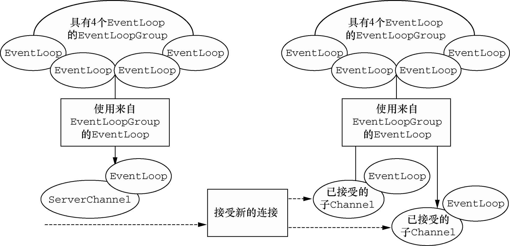

### Channel、EventLoop和ChannelFuture ###

- Channel——Socket；
- EventLoop——控制流、多线程处理、并发；
- ChannelFuture——异步通知。

#### Channel接口 ####

基本的I/O操作（bind()、connect()、read()和write()）依赖于底层网络传输所提供的原语。在基于Java的网络编程中，其基本的构造是class Socket。Netty的Channel接口所提供的API，大大地降低了直接使用Socket类的复杂性。此外，Channel也是拥有许多预定义的、专门化实现的广泛类层次结构的根，下面是一个简短的部分清单：

- EmbeddedChannel；
- LocalServerChannel；
- NioDatagramChannel；
- NioSctpChannel；
- NioSocketChannel。

#### EventLoop接口 ####

EventLoop定义了Netty的核心抽象，**用于处理连接的生命周期中所发生的事件**。目前，下图在高层次上说明了Channel、EventLoop、Thread以及EventLoopGroup之间的关系。

这些关系是：

- 一个`EventLoopGroup`包含一个或者多个`EventLoop`；
- 一个`EventLoop`在它的生命周期内只和一个`Thread`绑定；
- 所有由`EventLoop`处理的 I/O 事件都将在它专有的`Thread`上被处理；
- 一个`Channel`在它的生命周期内只注册于一个`EventLoop`；
- 一个`EventLoop`可能会被分配给一个或多个`Channel`。

注意，在这种设计中，一个给定Channel的 I/O 操作都是由相同的Thread执行的，实际上消除了对于同步的需要。

#### ChannelFuture接口 ####

正如我们已经解释过的那样，Netty中所有的 I/O 操作都是异步的。因为一个操作可能不会立即返回，所以我们需要一种用于在之后的某个时间点确定其结果的方法。为此，Netty提供了`ChannelFuture`接口，其`addListener()`方法注册了一个`ChannelFutureListener`，以便在某个操作完成时（无论是否成功）得到通知。

> 可以将ChannelFuture看作是将来要执行的操作的结果的占位符。它究竟什么时候被执行则可能取决于若干的因素，因此不可能准确地预测，但是可以肯定的是它将会被执行。此外，所有属于同一个Channel的操作都被保证其将以它们被调用的顺序被执行。

### ChannelHandler和ChannelPipeline ###

#### ChannelHandler接口 ####

从应用程序开发人员的角度来看，Netty的主要组件是ChannelHandler，它充当了所有处理入站和出站数据的应用程序逻辑的容器。这是可行的，因为ChannelHandler的方法是由网络事件（其中术语“事件”的使用非常广泛）触发的。事实上，**ChannelHandler可专门用于几乎任何类型的动作，例如将数据从一种格式转换为另外一种格式，或者处理转换过程中所抛出的异常**。

举例来说，`ChannelInboundHandler`是一个你将会经常实现的子接口。这种类型的`ChannelHandler`接收入站事件和数据，这些数据随后将会被你的应用程序的业务逻辑所处理。当你要给连接的客户端发送响应时，也可以从`ChannelInboundHandler`冲刷数据。你的应用程序的业务逻辑通常驻留在一个或者多个`ChannelInboundHandler`中。

#### ChannelPipeline接口 ####

`ChannelPipeline`提供了`ChannelHandler`链的容器，并定义了用于在该链上传播入站和出站事件流的API。当Channel被创建时，它会被自动地分配到它专属的`ChannelPipeline`。

使得事件流经`ChannelPipeline`是`ChannelHandler`的工作，它们是在应用程序的初始化或者引导阶段被安装的。这些对象接收事件、执行它们所实现的处理逻辑，并将数据传递给链中的下一个`ChannelHandler`。它们的执行顺序是由它们被添加的顺序所决定的。**实际上，被我们称为ChannelPipeline的是这些ChannelHandler的编排顺序**。

鉴于出站操作和入站操作是不同的，你可能会想知道如果将两个类别的`ChannelHandler`都混合添加到同一个`ChannelPipeline`中会发生什么。虽然`ChannelInboundHandler`和`ChannelOutboundHandler`都扩展自`ChannelHandler`，但是Netty能区分`ChannelInboundHandler`实现和`ChannelOutboundHandler`实现，并确保数据只会在具有相同定向类型的两个`ChannelHandler`之间传递。

当`ChannelHandler`被添加到`ChannelPipeline`时，它将会被分配一个`ChannelHandlerContext`，其代表了`ChannelHandler`和`ChannelPipeline`之间的绑定。虽然这个对象可以被用于获取底层的`Channel`，但是它主要还是被用于写出站数据。

#### 更加深入地了解ChannelHandler ####

正如我们之前所说的，有许多不同类型的ChannelHandler，它们各自的功能主要取决于它们的超类。Netty以适配器类的形式提供了大量默认的ChannelHandler实现，其旨在简化应用程序处理逻辑的开发过程。也就是说，**ChannelPipeline中的每个ChannelHandler将负责把事件转发到链中的下一个ChannelHandler**。这些适配器类（及它们的子类）将自动执行这个操作，所以你可以只重写那些你想要特殊处理的方法和事件。

下面这些是编写自定义ChannelHandler时经常会用到的适配器类：

- ChannelHandlerAdapter
- ChannelInboundHandlerAdapter
- ChannelOutboundHandlerAdapter
- ChannelDuplexHandler

### 引导 ###

Netty的引导类为应用程序的网络层配置提供了容器，这涉及将一个进程绑定到某个指定的端口，或者将一个进程连接到另一个运行在某个指定主机的指定端口上的进程。

因此，有两种类型的引导：一种用于客户端（简单地称为Bootstrap），而另一种（ServerBootstrap）用于服务器。无论你的应用程序使用哪种协议或者处理哪种类型的数据，唯一决定它使用哪种引导类的是它是作为一个客户端还是作为一个服务器。下表比较了这两种类型的引导类。

|       类　　别       |      Bootstrap       |  ServerBootstrap   |
| :------------------: | :------------------: | :----------------: |
|   网络编程中的作用   | 连接到远程主机和端口 | 绑定到一个本地端口 |
| EventLoopGroup的数目 |          1           |         2          |

> 注：ServerBootstrap类也可以只使用一个EventLoopGroup，此时其将在两个场景下共用同一个EventLoopGroup。

这两种类型的引导类之间的第一个区别已经讨论过了：ServerBootstrap将绑定到一个端口，因为服务器必须要监听连接，而Bootstrap则是由想要连接到远程节点的客户端应用程序所使用的。

第二个区别可能更加明显。引导一个客户端只需要一个EventLoopGroup，但是一个ServerBootstrap则需要两个（也可以是同一个实例）。为什么呢？

因为服务器需要两组不同的Channel。第一组将只包含一个ServerChannel，代表服务器自身的已绑定到某个本地端口的正在监听的套接字。而第二组将包含所有已创建的用来处理传入客户端连接（对于每个服务器已经接受的连接都有一个）的Channel。

与ServerChannel相关联的EventLoopGroup将分配一个负责为传入连接请求创建Channel的EventLoop。一旦连接被接受，第二个EventLoopGroup就会给它的Channel分配一个EventLoop。