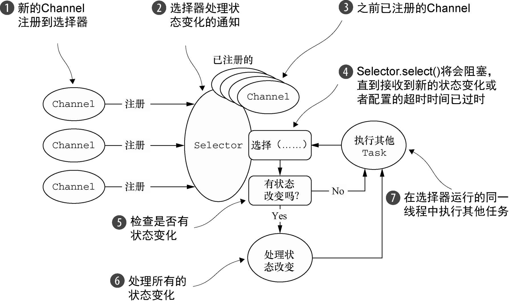
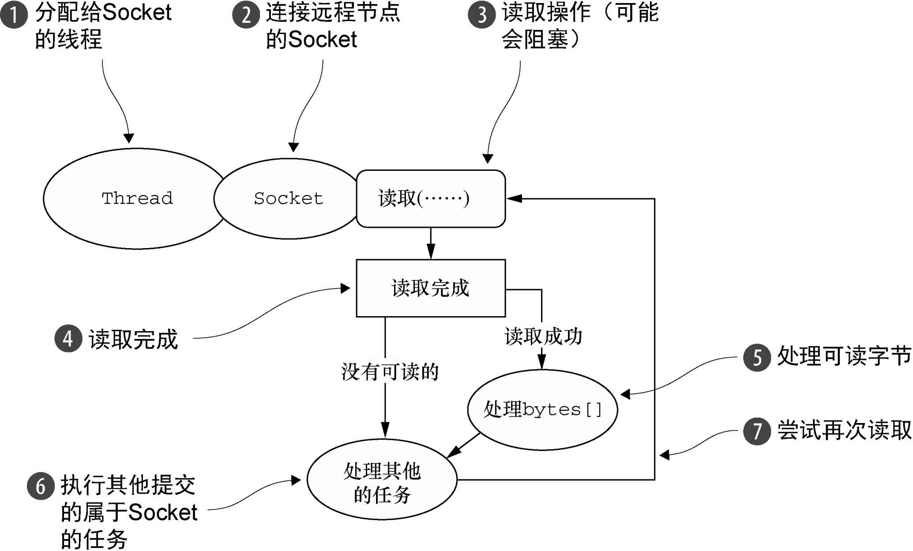

### 不通过Netty使用OIO和NIO ###

#### OIO实现方式 ####

```java
package cn.zifangsky.netty.exercise.chapter4;

import lombok.extern.slf4j.Slf4j;

import java.io.IOException;
import java.io.OutputStream;
import java.net.ServerSocket;
import java.net.Socket;
import java.nio.charset.StandardCharsets;

/**
 * JDK API中的阻塞IO实现的网络编程
 *
 * @author zifangsky
 * @date 2020/10/12
 * @since 1.0.0
 */
@Slf4j
public class PlainOioServer {


    public void server(int port) throws IOException {
        final ServerSocket socket = new ServerSocket(port);

        while (true){
            final Socket clientSocket = socket.accept();
            System.out.println("Accepted connection from " + clientSocket);

            //创建一个新的线程来处理该连接
            Thread thread = new Thread(() -> {
                OutputStream out;

                try {
                    out = clientSocket.getOutputStream();
                    //将消息写给已连接的客户端
                    out.write("Hi!\r\n".getBytes(StandardCharsets.UTF_8));
                    out.flush();

                    //关闭连接
                    clientSocket.close();
                }catch (IOException e){
                    log.error("An exception has occurred here!", e);
                }finally {
                    try {
                        clientSocket.close();
                    } catch (IOException e) {
                        log.error("An exception has occurred here!", e);
                    }
                }
            });

            //启动线程
            thread.start();
        }
    }

}
```

#### NIO实现方式 ####

```java
package cn.zifangsky.netty.exercise.chapter4;

import lombok.extern.slf4j.Slf4j;

import java.io.IOException;
import java.net.InetSocketAddress;
import java.net.ServerSocket;
import java.nio.ByteBuffer;
import java.nio.channels.SelectionKey;
import java.nio.channels.Selector;
import java.nio.channels.ServerSocketChannel;
import java.nio.channels.SocketChannel;
import java.nio.charset.StandardCharsets;
import java.util.Iterator;
import java.util.Set;

/**
 * JDK API中的非阻塞IO实现的网络编程
 *
 * @author zifangsky
 * @date 2020/10/12
 * @since 1.0.0
 */
@Slf4j
public class PlainNioServer {

    public void server(int port) throws IOException {
        ServerSocketChannel serverSocketChannel = ServerSocketChannel.open();
        serverSocketChannel.configureBlocking(false);

        ServerSocket serverSocket = serverSocketChannel.socket();
        //将服务器绑定到指定端口
        serverSocket.bind(new InetSocketAddress(port));

        //打开Selector来处理Channel
        Selector selector = Selector.open();
        //将ServerSocket注册到Selector，以接受连接
        serverSocketChannel.register(selector, SelectionKey.OP_ACCEPT);
        final ByteBuffer msg = ByteBuffer.wrap("Hi!\r\n".getBytes(StandardCharsets.UTF_8));

        while (true){
            try {
                //等待需要处理的新事件，阻塞将一直持续到下一个传入事件
                selector.select();
            }catch (IOException e){
                log.error("An exception has occurred here!", e);
                break;
            }

            //获取所有接收事件的 SelectionKey 实例
            Set<SelectionKey> readyKeys = selector.selectedKeys();
            Iterator<SelectionKey> iterator = readyKeys.iterator();

            while (iterator.hasNext()){
                SelectionKey key = iterator.next();
                iterator.remove();

                try {
                    //检查事件是否是一个新的已经就绪可以被接受的连接
                    if(key.isAcceptable()){
                        ServerSocketChannel server = (ServerSocketChannel) key.channel();
                        SocketChannel client = server.accept();
                        client.configureBlocking(false);
                        //接受客户端，并将它注册到选择器
                        client.register(selector, SelectionKey.OP_WRITE | SelectionKey.OP_READ, msg.duplicate());
                        System.out.println("Accepted connection from " + client);
                    }

                    //检查套接字是否已经准备好写数据
                    if(key.isWritable()){
                        SocketChannel client = (SocketChannel) key.channel();
                        ByteBuffer buffer = (ByteBuffer) key.attachment();
                        while (buffer.hasRemaining()){
                            //将数据写到已连接的客户端
                            if(client.write(buffer) == 0){
                                break;
                            }
                        }

                        //关闭连接
                        client.close();
                    }
                }catch (IOException ex){
                    log.error("An exception has occurred here!", ex);
                    key.cancel();
                    try {
                        key.channel().close();
                    } catch (IOException cex) {
                        // ignore on close
                    }
                }
            }
        }
    }

}
```

### Netty内置的传输 ###

Netty内置了一些可开箱即用的传输。因为并不是它们所有的传输都支持每一种协议，所以你必须选择一个和你的应用程序所使用的协议相容的传输。

| 名　　称 | 包                          | 描　　述                                                     |
| -------- | --------------------------- | ------------------------------------------------------------ |
| NIO      | io.netty.channel.socket.nio | 使用java.nio.channels包作为基础——基于选择器的方式            |
| Epoll    | io.netty.channel.epoll      | 由JNI驱动的epoll()和非阻塞IO。这个传输支持只有在Linux上可用的多种特性，如SO_REUSEPORT，比NIO传输更快，而且是完全非阻塞的 |
| OIO      | io.netty.channel.socket.oio | 使用java.net包作为基础——使用阻塞流                           |
| Local    | io.netty.channel.local      | 可以在VM内部通过管道进行通信的本地传输                       |
| Embedded | io.netty.channel.embedded   | Embedded传输，允许使用ChannelHandler而又不需要一个真正的基于网络的传输。这在测试你的ChannelHandler实现时非常有用 |

#### NIO——非阻塞I/O ####

```java
package cn.zifangsky.netty.exercise.chapter4;

import io.netty.bootstrap.ServerBootstrap;
import io.netty.buffer.ByteBuf;
import io.netty.buffer.Unpooled;
import io.netty.channel.*;
import io.netty.channel.nio.NioEventLoopGroup;
import io.netty.channel.socket.SocketChannel;
import io.netty.channel.socket.nio.NioServerSocketChannel;
import lombok.extern.slf4j.Slf4j;

import java.net.InetSocketAddress;
import java.nio.charset.StandardCharsets;

/**
 * Netty的非阻塞IO实现的网络编程
 *
 * @author zifangsky
 * @date 2020/10/12
 * @since 1.0.0
 */
@Slf4j
public class NettyNioServer {

    public void server(int port) throws Exception {
        final ByteBuf buf = Unpooled.unreleasableBuffer(Unpooled.copiedBuffer("Hi!\r\n".getBytes(StandardCharsets.UTF_8)));

        //1. 创建EventLoopGroup
        EventLoopGroup group = new NioEventLoopGroup();

        try {
            //2. 创建ServerBootstrap
            ServerBootstrap bootstrap = new ServerBootstrap();
            bootstrap.group(group)
                    //指定使用NIO传输的Channel
                    .channel(NioServerSocketChannel.class)
                    //指定监听端口
                    .localAddress(new InetSocketAddress(port))
                    //添加一个EchoServer-Handler到子Channel的ChannelPipeline
                    .childHandler(new ChannelInitializer<SocketChannel>() {
                        @Override
                        protected void initChannel(SocketChannel sc) throws Exception {
                            sc.pipeline().addLast(new ChannelInboundHandlerAdapter(){
                                @Override
                                public void channelActive(ChannelHandlerContext ctx) throws Exception {
                                    ctx.writeAndFlush(buf.duplicate())
                                            .addListener(ChannelFutureListener.CLOSE);
                                }
                            });
                        }
                    });

            //3. 异步绑定服务器，并调用sync()方法阻塞等待直到绑定完成
            ChannelFuture future = bootstrap.bind().sync();
            //4. 获取Channel的CloseFuture，并阻塞当前线程直到它完成
            future.channel().closeFuture().sync();
        }finally {
            //5. 关闭EventLoopGroup，释放所有的资源
            group.shutdownGracefully().sync();
        }
    }

}
```

NIO提供了一个所有I/O操作的全异步的实现。它利用了自NIO子系统被引入JDK 1.4时便可用的基于选择器的API。

选择器背后的基本概念是充当一个注册表，在那里你将可以请求在Channel的状态发生变化时得到通知。可能的状态变化有：

- **新的Channel已被接受并且就绪**；
- **Channel连接已经完成**；
- **Channel有已经就绪的可供读取的数据**；
- **Channel可用于写数据**。

选择器运行在一个检查状态变化并对其做出相应响应的线程上，在应用程序对状态的改变做出响应之后，选择器将会被重置，并将重复这个过程。

下表中的常量值代表了由`class java.nio.channels.SelectionKey`定义的位模式。这些位模式可以组合起来定义一组应用程序正在请求通知的状态变化集。

| 名　　称   | 描　　 述                                                    |
| ---------- | ------------------------------------------------------------ |
| OP_ACCEPT  | 在接受新连接并创建`Channel`时获得通知                        |
| OP_CONNECT | 在建立一个连接时获得通知                                     |
| OP_READ    | 当数据已经就绪，可以从`Channel`中读取时获得通知              |
| OP_WRITE   | 当可以向`Channel`中写更多的数据时获得通知。这处理了套接字缓冲区被完全填满时的情况，这种情况通常发生在数据的发送速度比远程节点可处理的速度更快的时候 |

对于所有Netty的传输实现都共有的用户级别API完全地隐藏了这些NIO的内部细节。



> **零拷贝**（zero-copy）是一种目前只有在使用NIO和Epoll传输时才可使用的特性。它使你可以快速高效地将数据从文件系统移动到网络接口，而不需要将其从内核空间复制到用户空间，其在像FTP或者HTTP这样的协议中可以显著地提升性能。但是，并不是所有的操作系统都支持这一特性。特别地，它对于实现了数据加密或者压缩的文件系统是不可用的——只能传输文件的原始内容。反过来说，传输已被加密的文件则不是问题。


#### Epoll——用于Linux的本地非阻塞传输 ####

正如我们之前所说的，Netty的NIO传输基于Java提供的异步/非阻塞网络编程的通用抽象。虽然这保证了Netty的非阻塞API可以在任何平台上使用，但它也包含了相应的限制，因为JDK为了在所有系统上提供相同的功能，必须做出妥协。

Linux作为高性能网络编程的平台，其重要性与日俱增，这催生了大量先进特性的开发，其中包括epoll——一个高度可扩展的I/O事件通知特性。这个API自Linux内核版本2.5.44（2002）被引入，提供了比旧的POSIX select和poll系统调用[3]更好的性能，同时现在也是Linux上非阻塞网络编程的事实标准。Linux JDK NIO API使用了这些epoll调用。

Netty为Linux提供了一组NIO API，其以一种和它本身的设计更加一致的方式使用epoll，并且以一种更加轻量的方式使用中断。**如果你的应用程序旨在运行于Linux系统，那么请考虑利用这个版本的传输；你将发现在高负载下它的性能要优于JDK的NIO实现**。

如果要在上个小节的代码清单中使用epoll替代NIO，只需要将`NioEventLoopGroup`替换为`EpollEventLoopGroup`，并且将`NioServerSocketChannel.class`替换为`EpollServerSocketChannel.class`即可。


#### OIO——旧的阻塞I/O ####

Netty的OIO传输实现代表了一种折中：它可以通过常规的传输API使用，但是由于它是建立在java.net包的阻塞实现之上的，所以它不是异步的。但是，它仍然非常适合于某些用途。

你可能会想，Netty是如何能够使用和用于异步传输相同的API来支持OIO的呢。答案就是，**Netty利用了SO_TIMEOUT这个Socket标志，它指定了等待一个I/O操作完成的最大毫秒数。如果操作在指定的时间间隔内没有完成，则将会抛出一个SocketTimeout Exception。Netty将捕获这个异常并继续处理循环。在EventLoop下一次运行时，它将再次尝试**。这实际上也是类似于Netty这样的异步框架能够支持OIO的唯一方式。下图说明了这个逻辑。




#### 用于JVM内部通信的Local传输 ####

Netty提供了一个Local传输，用于在同一个JVM中运行的客户端和服务器程序之间的异步通信。同样，这个传输也支持对于所有Netty传输实现都共同的API。

在这个传输中，和服务器Channel相关联的SocketAddress并没有绑定物理网络地址；相反，只要服务器还在运行，它就会被存储在注册表里，并在Channel关闭时注销。因为这个传输并不接受真正的网络流量，所以它并不能够和其他传输实现进行互操作。因此，客户端希望连接到（在同一个JVM中）使用了这个传输的服务器端时也必须使用它。除了这个限制，它的使用方式和其他的传输一模一样。


#### Embedded传输 ####

Netty提供了一种额外的传输，使得你可以将一组ChannelHandler作为帮助器类嵌入到其他的ChannelHandler内部。通过这种方式，你将可以扩展一个ChannelHandler的功能，而又不需要修改其内部代码。

不足为奇的是，Embedded传输的关键是一个被称为EmbeddedChannel的具体的Channel实现。在第9章中，我们将详细地讨论如何使用这个类来为ChannelHandler的实现创建单元测试用例。


### 传输的用例 ###

既然我们已经详细地了解了所有的传输，那么让我们考虑一下选用一个适用于特定用途的协议的因素吧。正如前面所提到的，并不是所有的传输都支持所有的核心协议，其可能会限制你的选择。下表展示了截止出版时的传输和其所支持的协议。

|     传　　输     | TCP  | UDP  | SCTP* | UDT  |
| :--------------: | :--: | :--: | :---: | :--: |
|       NIO        |  √   |  √   |   √   |  √   |
| Epoll（仅Linux） |  √   |  √   |   —   |  —   |
|       OIO        |  √   |  √   |   √   |  √   |

应用程序的最佳传输：

| 应用程序的需求                 | 推荐的传输                    |
| ------------------------------ | ----------------------------- |
| 非阻塞代码库或者一个常规的起点 | NIO（或者在Linux上使用epoll） |
| 阻塞代码库                     | OIO                           |
| 在同一个JVM内部的通信          | Local                         |
| 测试ChannelHandler的实现       | Embedded                      |

