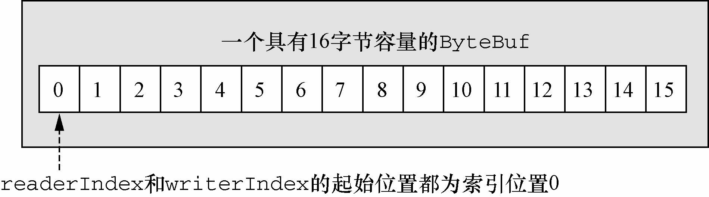
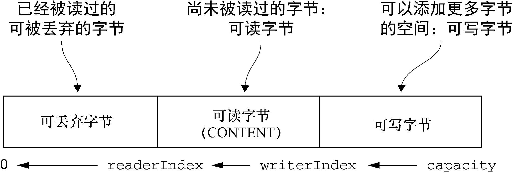

### ByteBuf类——Netty的数据容器 ###

ByteBuf维护了两个不同的索引：一个用于读取，一个用于写入。当你从ByteBuf读取时，它的readerIndex将会被递增已经被读取的字节数。同样地，当你写入ByteBuf时，它的writerIndex也会被递增。下图展示了一个空ByteBuf的布局结构和状态。




### ByteBuf的使用模式 ###

在使用Netty时，你将遇到几种常见的围绕ByteBuf而构建的使用模式。

#### 堆缓冲区 ####

最常用的ByteBuf模式是将数据存储在JVM的堆空间中。这种模式被称为支撑数组（`backing array`），它能在没有使用池化的情况下提供快速的分配和释放。这种方式非常适合于有遗留的数据需要处理的情况。

```java
/**
 * Backing array
 */
private void heapBuffer(){
	ByteBuf heapBuf = BYTE_BUF_FROM_SOMEWHERE;
	//检查 ByteBuf 是否有一个支撑数组
	if(heapBuf.hasArray()){
		//如果有，则获取对该数组的引用
		byte[] arr = heapBuf.array();
		//计算第一个字节的偏移量
		int offset = heapBuf.arrayOffset();
		//获得可读字节数
		int length = heapBuf.readableBytes();
		//使用数组、偏移量和长度作为参数调用你的方法
		this.handleArray(arr, offset, length);
	}
}
```

> 注意：当hasArray()方法返回false时，尝试访问支撑数组将触发一个UnsupportedOperationException。这个模式类似于JDK的ByteBuffer的用法。


#### 直接缓冲区 ####

直接缓冲区是另外一种ByteBuf模式。我们期望用于对象创建的内存分配永远都来自于堆中，但这并不是必须的——NIO在JDK 1.4中引入的ByteBuffer类允许JVM实现通过本地调用来分配内存。这主要是为了避免在每次调用本地I/O操作之前（或者之后）将缓冲区的内容复制到一个中间缓冲区（或者从中间缓冲区把内容复制到缓冲区）。

直接缓冲区的主要缺点是，相对于基于堆的缓冲区，它们的分配和释放都较为昂贵。如果你正在处理遗留代码，你也可能会遇到另外一个缺点：因为数据不是在堆上，所以你不得不进行一次复制，如下面代码清单所示。

```java
/**
 * Direct buffer data access
 */
private void directBuffer(){
	ByteBuf directBuf = BYTE_BUF_FROM_SOMEWHERE;
	//检查ByteBuf 是否由数组支撑。如果不是，则这是一个直接缓冲区
	if(!directBuf.hasArray()){
		//获得可读字节数
		int length = directBuf.readableBytes();
		//分配一个新的数组来保存具有该长度的字节数据
		byte[] arr = new byte[length];
		//将字节复制到该数组
		directBuf.getBytes(directBuf.readerIndex(), arr);
		//使用数组、偏移量和长度作为参数调用你的方法
		this.handleArray(arr, 0, length);
	}
}
```


#### 复合缓冲区 ####

第三种也是最后一种模式使用的是复合缓冲区，它为多个ByteBuf提供一个聚合视图。在这里你可以根据需要添加或者删除ByteBuf实例，这是一个JDK的ByteBuffer实现完全缺失的特性。

Netty通过一个ByteBuf子类——`CompositeByteBuf`——实现了这个模式，它提供了一个将多个缓冲区表示为单个合并缓冲区的虚拟表示。

> 注：CompositeByteBuf中的ByteBuf实例可能同时包含直接内存分配和非直接内存分配。如果其中只有一个实例，那么对CompositeByteBuf上的hasArray()方法的调用将返回该组件上的hasArray()方法的值；否则它将返回false。

使用ByteBuffer的复合缓冲区模式：

```java
/**
 * Composite buffer pattern using ByteBuffer
 */
private void byteBufferComposite(ByteBuffer header, ByteBuffer body) {
	ByteBuffer[] message = new ByteBuffer[]{header, body};
	ByteBuffer message2 = ByteBuffer.allocate(header.remaining() + body.remaining());

	message2.put(header);
	message2.put(body);
	message2.flip();

	//其他操作
}
```

分配和复制操作，以及伴随着对数组管理的需要，使得这个版本的实现效率低下而且笨拙。下面代码清单展示了一个使用了CompositeByteBuf的版本。

```java
/**
 * Composite buffer pattern using CompositeByteBuf
 */
private void byteBufComposite(ByteBuf header, ByteBuf body) {
	CompositeByteBuf message = Unpooled.compositeBuffer();
	//将ByteBuf实例追加到CompositeByteBuf
	message.addComponents(header, body);

	//删除位于索引位置为 0（第一个组件）的ByteBuf
	message.removeComponent(0);

	//循环遍历所有的ByteBuf实例
	for(ByteBuf buf : message){
		System.out.println(buf.toString(CharsetUtil.UTF_8));
	}

	//其他操作
}
```

需要注意的是，CompositeByteBuf可能不支持访问其支撑数组，因此访问CompositeByteBuf中的数据类似于（访问）直接缓冲区的模式，如下面代码清单所示。

```java
/**
 * Accessing the data in a CompositeByteBuf
 */
private void byteBufCompositeArray() {
	CompositeByteBuf compBuf = Unpooled.compositeBuffer();
	
	//获得可读字节数
	int length = compBuf.readableBytes();
	//分配一个新的数组来保存具有该长度的字节数据
	byte[] arr = new byte[length];
	//将字节复制到该数组
	compBuf.getBytes(compBuf.readerIndex(), arr);
	//使用数组、偏移量和长度作为参数调用你的方法
	this.handleArray(arr, 0, length);
}
```


### 字节级操作 ###

#### 随机访问索引 ####

如同在普通的Java字节数组中一样，ByteBuf的索引是从零开始的：第一个字节的索引是0，最后一个字节的索引总是capacity() - 1。

```java
/**
 * Access data
 */
private void byteBufRelativeAccess(){
	ByteBuf buffer = BYTE_BUF_FROM_SOMEWHERE;
	
	for (int i = 0; i < buffer.capacity(); i++) {
		byte b = buffer.getByte(i);
		System.out.println((char) b);
	}
}
```

需要注意的是，使用那些需要一个索引值参数的方法（的其中）之一来访问数据既不会改变`readerIndex`也不会改变`writerIndex`。如果有需要，也可以通过调用`readerIndex(index)`或者`writerIndex(index)`来手动移动这两者。


#### 顺序访问索引 ####

虽然ByteBuf同时具有读索引和写索引，但是JDK的ByteBuffer却只有一个索引，这也就是为什么必须调用flip()方法来在读模式和写模式之间进行切换的原因。下图展示了ByteBuf是如何被它的两个索引划分成3个区域的。




#### 可丢弃字节 ####

在上图中标记为可丢弃字节的分段包含了已经被读过的字节。通过调用`discardReadBytes()`方法，可以丢弃它们并回收空间。这个分段的初始大小为0，会随着read操作的执行而增加（get*操作不会移动readerIndex）。

> Discards the bytes between the **0th** index and **readerIndex**. It moves the bytes between **readerIndex** and **writerIndex** to the **0th** index, and sets **readerIndex** and **writerIndex** to **0** and **oldWriterIndex - oldReaderIndex** respectively.

虽然你可能会倾向于频繁地调用discardReadBytes()方法以确保可写分段的最大化，但是请注意，这将极有可能会导致内存复制，因此我们建议只在有真正需要的时候才这样做（比如当内存非常宝贵的时候）。


#### 可读字节 ####

ByteBuf的可读字节分段存储了实际数据。新分配的、包装的或者复制的缓冲区的默认的readerIndex值为0。**任何名称以read或者skip开头的操作都将检索或者跳过位于当前readerIndex的数据，并且将它增加已读字节数**。

如果被调用的方法需要一个ByteBuf参数作为写入的目标，并且没有指定目标索引参数，那么该目标缓冲区的writerIndex也将被增加，例如：

```java
readBytes(ByteBuf dest);
```

下列代码展示了如何读取所有可以读的字节：

```java
/**
 * Read all data
 */
private void readAllData(){
	ByteBuf buffer = BYTE_BUF_FROM_SOMEWHERE;

	while (buffer.isReadable()) {
		System.out.println(buffer.readByte());
	}
}
```


#### 可写字节 ####

可写字节分段是指一个拥有未定义内容的、写入就绪的内存区域。新分配的缓冲区的writerIndex的默认值为0。任何名称以write开头的操作都将从当前的writerIndex处开始写数据，并将它增加已经写入的字节数。如果写操作的目标也是ByteBuf，并且没有指定源索引的值，则源缓冲区的readerIndex也同样会被增加相同的大小。这个调用如下所示：

```java
writeBytes(ByteBuf dest);
```

下列代码是一个用随机整数值填充缓冲区，直到它空间不足为止的例子。`writeableBytes()`方法在这里被用来确定该缓冲区中是否还有足够的空间。

```java
/**
 * Write data
 */
private void write(){
	ByteBuf buffer = BYTE_BUF_FROM_SOMEWHERE;

	while (buffer.writableBytes() >= 4) {
		buffer.writeInt(RANDOM.nextInt());
	}
}
```


#### 索引管理 ####

JDK的InputStream定义了mark(int readlimit)和reset()方法，这些方法分别被用来将流中的当前位置标记为指定的值，以及将流重置到该位置。

同样，可以通过调用markReaderIndex()、markWriterIndex()、resetWriterIndex()和resetReaderIndex()来标记和重置ByteBuf的readerIndex和writerIndex。这些和InputStream上的调用类似，只是没有readlimit参数来指定标记什么时候失效。

也可以通过调用readerIndex(int)或者writerIndex(int)来将索引移动到指定位置。试图将任何一个索引设置到一个无效的位置都将导致一个IndexOutOfBoundsException。

可以通过调用clear()方法来将readerIndex和writerIndex都设置为0。**注意，这并不会清除内存中的内容**。和之前一样，ByteBuf包含3个分段。下图展示了在clear()方法被调用之后ByteBuf的状态。


调用clear()比调用discardReadBytes()轻量得多，因为它将只是重置索引而不会复制任何的内存。


#### 查找操作 ####

在ByteBuf中有多种可以用来确定指定值的索引的方法。最简单的是使用indexOf()方法。较复杂的查找可以通过那些需要一个`ByteProcessor`作为参数的方法达成。

```java
/**
 * Using ByteProcessor to find \r
 */
private void byteProcessor(){
	ByteBuf buffer = BYTE_BUF_FROM_SOMEWHERE;

	int index = buffer.forEachByte(ByteProcessor.FIND_CR);
}
```


#### 派生缓冲区 ####

派生缓冲区为ByteBuf提供了以专门的方式来呈现其内容的视图。这类视图是通过以下方法被创建的：

- duplicate()；
- slice()；
- slice(int, int)；
- Unpooled.unmodifiableBuffer(…)；
- order(ByteOrder)；
- readSlice(int)。

每个这些方法都将返回一个新的ByteBuf实例，它具有自己的读索引、写索引和标记索引。其内部存储和JDK的ByteBuffer一样也是共享的。这使得派生缓冲区的创建成本是很低廉的，但是这也意味着，**如果你修改了它的内容，也同时修改了其对应的源实例，所以要小心**。

> 如果需要一个现有缓冲区的真实副本，请使用copy()或者copy(int, int)方法。不同于派生缓冲区，由这个调用所返回的ByteBuf拥有独立的数据副本。

```java
/**
 * Using Slice a ByteBuf
 */
private void byteBufSlice(){
	ByteBuf buffer = Unpooled.copiedBuffer("Netty in Action rocks!", CharsetUtil.UTF_8);
	//创建一个从索引0开始到索引5结束的一个新切片
	ByteBuf sliced = buffer.slice(0, 5);
	System.out.println(sliced.toString(CharsetUtil.UTF_8));

	//更新索引0处的字节
	buffer.setByte(0, 'A');
	//此断言将会成功，因为数据是共享的，对其中一个所做的更改对另外一个也是可见的
	assert buffer.getByte(0) == sliced.getByte(0);
//  System.out.println(sliced.toString(CharsetUtil.UTF_8));
}
```


#### 读/写操作 ####

正如我们所提到过的，有两种类别的读/写操作：

- get()和set()操作，从给定的索引开始，并且保持索引不变；
- read()和write()操作，从给定的索引开始，并且会根据已经访问过的字节数对索引进行调整。

```java
/**
 * get() and set() usage
 */
private void byteBufSetGet(){
	ByteBuf buf = Unpooled.copiedBuffer("Netty in Action rocks!", CharsetUtil.UTF_8);
	//打印第一个字符'N'
	System.out.println((char)buf.getByte(0));

	//获取当前的readerIndex 和writerIndex
	int readerIndex = buf.readerIndex();
	int writerIndex = buf.writerIndex();

	//更新索引0处的字节
	buf.setByte(0, 'A');
	//再次打印第一个字符，此时是'A'
	System.out.println((char)buf.getByte(0));

	//此断言将会成功，因为这些操作并不会修改相应的索引
	assert readerIndex == buf.readerIndex();
	assert writerIndex == buf.writerIndex();
}
```

```java
/**
 * read() and write() usage
 */
private void byteBufWriteRead(){
	ByteBuf buf = Unpooled.copiedBuffer("Netty in Action rocks!", CharsetUtil.UTF_8);
	//打印第一个字符'N'
	System.out.println((char)buf.readByte());

	//获取当前的readerIndex 和writerIndex
	int readerIndex = buf.readerIndex();
	int writerIndex = buf.writerIndex();

	//将字符'?'追加到缓冲区
	buf.writeByte('?');
	//重新打印最后一个字符，此时是'?'
	System.out.println((char)buf.getByte(buf.writerIndex() - 1));

	//此断言将会成功，因为writeByte()方法移动了writerIndex
	assert readerIndex == buf.readerIndex();
	assert writerIndex != buf.writerIndex();
}
```


#### 更多的操作 ####

其他有用的操作：

| 名　　称        | 描　　述                                                     |
| --------------- | ------------------------------------------------------------ |
| isReadable()    | 如果至少有一个字节可供读取，则返回true                       |
| isWritable()    | 如果至少有一个字节可被写入，则返回true                       |
| readableBytes() | 返回可被读取的字节数                                         |
| writableBytes() | 返回可被写入的字节数                                         |
| capacity()      | 返回ByteBuf可容纳的字节数。在此之后，它会尝试再次扩展直 到达到maxCapacity() |
| maxCapacity()   | 返回ByteBuf可以容纳的最大字节数                              |
| hasArray()      | 如果ByteBuf由一个字节数组支撑，则返回true                    |
| array()         | 如果 ByteBuf由一个字节数组支撑则返回该数组；否则，它将抛出一个UnsupportedOperationException异常 |


### ByteBufHolder接口 ###

我们经常发现，除了实际的数据负载之外，我们还需要存储各种属性值。HTTP响应便是一个很好的例子，除了表示为字节的内容，还包括状态码、cookie等。

为了处理这种常见的用例，Netty提供了ByteBufHolder。ByteBufHolder也为Netty的高级特性提供了支持，如缓冲区池化，其中可以从池中借用ByteBuf，并且在需要时自动释放。

ByteBufHolder只有几种用于访问底层数据和引用计数的方法。下表列出了它们（这里不包括它继承自ReferenceCounted的那些方法）。

ByteBufHolder的操作：

| 名　　称    | 描　　述                                                     |
| ----------- | ------------------------------------------------------------ |
| content()   | 返回由这个ByteBufHolder所持有的ByteBuf                       |
| copy()      | 返回这个ByteBufHolder的一个深拷贝，包括一个其所包含的ByteBuf的非共享拷贝 |
| duplicate() | 返回这个ByteBufHolder的一个浅拷贝，包括一个其所包含的ByteBuf的共享拷贝 |

如果想要实现一个将其有效负载存储在ByteBuf中的消息对象，那么ByteBufHolder将是个不错的选择。

```java
/**
 * {@link ByteBufHolder}
 */
private void byteBuff(){
	ByteBuf buf = Unpooled.copiedBuffer("Netty in Action rocks!", CharsetUtil.UTF_8);
	ByteBufHolder holder = new DefaultByteBufHolder(buf);
	//创建一个深拷贝
	ByteBuf copied = holder.copy().content();
}
```


### ByteBuf分配 ###

#### 按需分配：ByteBufAllocator接口 ####

为了降低分配和释放内存的开销，Netty通过interface ByteBufAllocator实现了（ByteBuf的）池化，它可以用来分配我们所描述过的任意类型的ByteBuf实例。使用池化是特定于应用程序的决定，其并不会以任何方式改变ByteBuf API（的语义）。

ByteBufAllocator的方法：

| 名　　称                                                     | 描　　述                                                     |
| ------------------------------------------------------------ | ------------------------------------------------------------ |
| buffer()<br />buffer(int initialCapacity);<br/>buffer(int initialCapacity, int maxCapacity); | 返回一个基于堆或者直接内存存储的ByteBuf                      |
| heapBuffer()<br/>heapBuffer(int initialCapacity)<br/>heapBuffer(int initialCapacity, int maxCapacity) | 返回一个基于堆内存存储的ByteBuf                              |
| directBuffer()<br/>directBuffer(int initialCapacity)<br/>directBuffer(int initialCapacity, int maxCapacity) | 返回一个基于直接内存存储的ByteBuf                            |
| compositeBuffer()<br/>compositeBuffer(int maxNumComponents)<br/>compositeDirectBuffer()<br/>compositeDirectBuffer(int maxNumComponents);<br/>compositeHeapBuffer()<br/>compositeHeapBuffer(int maxNumComponents); | 返回一个可以通过添加最大到指定数目的基于堆的或者直接内存存储的缓冲区来扩展的CompositeByteBuf |
| ioBuffer()                                                   | 返回一个用于套接字的I/O操作的ByteBuf                         |

可以通过Channel（每个都可以有一个不同的ByteBufAllocator实例）或者绑定到ChannelHandler的ChannelHandlerContext获取一个到ByteBufAllocator的引用。

```java
/**
 * Obtaining a ByteBufAllocator reference
 */
private void obtainingByteBufAllocatorReference(){
	Channel channel = CHANNEL_FROM_SOMEWHERE;
	//从Channel获取一个到ByteBufAllocator的引用
	ByteBufAllocator allocator = channel.alloc();

	//get reference form somewhere
	ChannelHandlerContext ctx = CHANNEL_HANDLER_CONTEXT_FROM_SOMEWHERE;
	//从ChannelHandlerContext 获取一个到ByteBufAllocator 的引用
	ByteBufAllocator allocator2 = ctx.alloc();
	//...
}
```

Netty提供了两种ByteBufAllocator的实现：`PooledByteBufAllocator`和`Unpooled-ByteBufAllocator`。前者池化了ByteBuf的实例以提高性能并最大限度地减少内存碎片。此实现使用了一种称为`jemalloc`的已被大量现代操作系统所采用的高效方法来分配内存。后者的实现不池化ByteBuf实例，并且在每次它被调用时都会返回一个新的实例。

虽然Netty默认使用了PooledByteBufAllocator，但这可以很容易地通过ChannelConfig API或者在引导你的应用程序时指定一个不同的分配器来更改。


#### Unpooled缓冲区 ####

可能某些情况下，你未能获取一个到ByteBufAllocator的引用。对于这种情况，Netty提供了一个简单的称为Unpooled的工具类，它提供了静态的辅助方法来创建未池化的ByteBuf实例。下表列举了这些中最重要的方法。

| 名　　称                                                     | 描　　述                                  |
| ------------------------------------------------------------ | ----------------------------------------- |
| buffer()<br/>buffer(int initialCapacity)<br/>buffer(int initialCapacity, int maxCapacity) | 返回一个未池化的基于堆内存存储的ByteBuf   |
| directBuffer()<br/>directBuffer(int initialCapacity)<br/>directBuffer(int initialCapacity, int maxCapacity) | 返回一个未池化的基于直接内存存储的ByteBuf |
| wrappedBuffer()                                              | 返回一个包装了给定数据的ByteBuf           |
| copiedBuffer()                                               | 返回一个复制了给定数据的ByteBuf           |

Unpooled类还使得ByteBuf同样可用于那些并不需要Netty的其他组件的非网络项目，使得其能得益于高性能的可扩展的缓冲区API。


#### ByteBufUtil类 ####

ByteBufUtil提供了用于操作ByteBuf的静态的辅助方法。因为这个API是通用的，并且和池化无关，所以这些方法已然在分配类的外部实现。

这些静态方法中最有价值的可能就是hexdump()方法，它以十六进制的表示形式打印ByteBuf的内容。这在各种情况下都很有用，例如，出于调试的目的记录ByteBuf的内容。十六进制的表示通常会提供一个比字节值的直接表示形式更加有用的日志条目，此外，十六进制的版本还可以很容易地转换回实际的字节表示。

另一个有用的方法是boolean equals(ByteBuf, ByteBuf)，它被用来判断两个ByteBuf实例的相等性。如果你实现自己的ByteBuf子类，你可能会发现ByteBufUtil的其他有用方法。