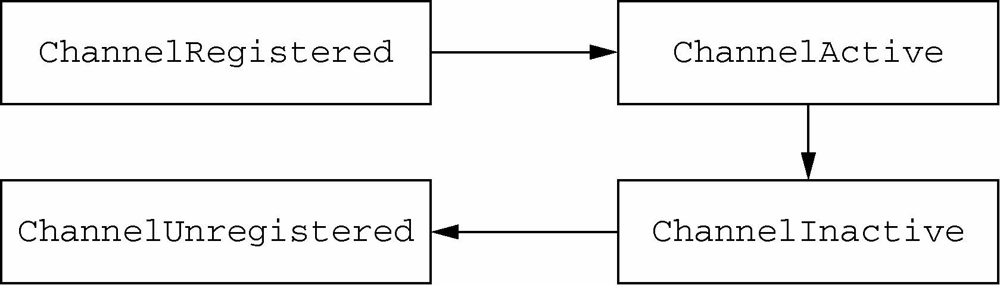
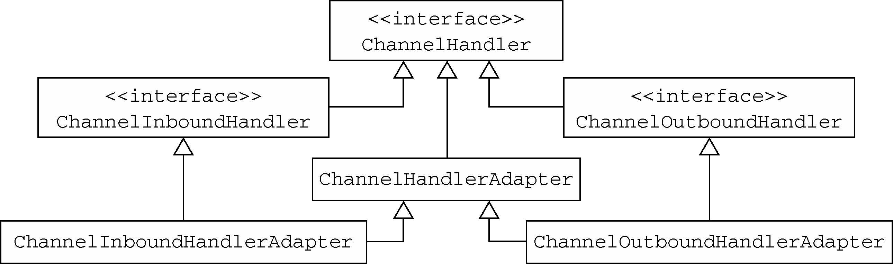
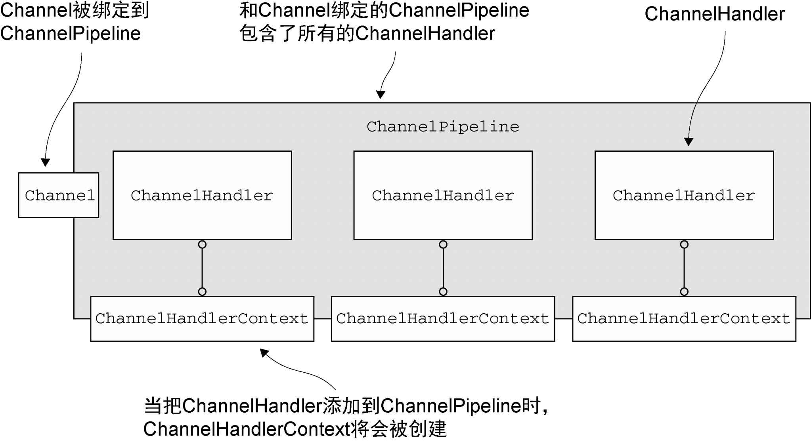
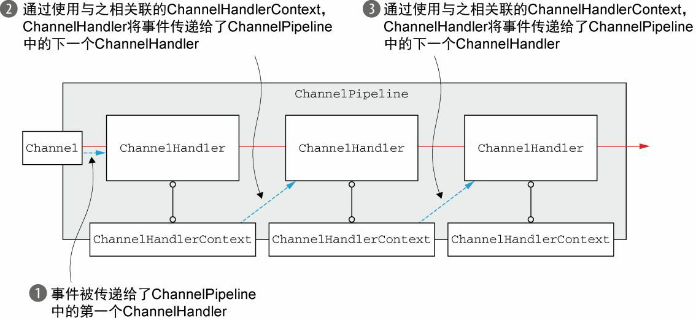
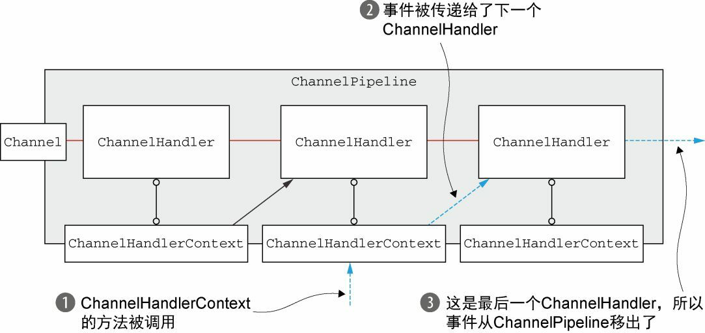

### ChannelHandler家族 ###

在我们开始详细地学习ChannelHandler之前，我们将在Netty的组件模型的这部分基础上花上一些时间。

#### Channel的生命周期 ####

Interface Channel定义了一组和`ChannelInboundHandler` API密切相关的简单但功能强大的状态模型，下表列出了Channel的这4个状态。

Channel的生命周期状态：

| 状　　态            | 描　　述                                                     |
| ------------------- | ------------------------------------------------------------ |
| ChannelUnregistered | Channel已经被创建，但还未注册到EventLoop                     |
| ChannelRegistered   | Channel已经被注册到了EventLoop                               |
| ChannelActive       | Channel处于活动状态（已经连接到它的远程节点）。它现在可以接收和发送数据了 |
| ChannelInactive     | Channel没有连接到远程节点                                    |

Channel的正常生命周期如下图所示。当这些状态发生改变时，将会生成对应的事件。这些事件将会被转发给ChannelPipeline中的ChannelHandler，其可以随后对它们做出响应。




#### ChannelHandler的生命周期 ####

下表中列出了interface ChannelHandler定义的生命周期操作，在ChannelHandler被添加到ChannelPipeline中或者被从ChannelPipeline中移除时会调用这些操作。这些方法中的每一个都接受一个ChannelHandlerContext参数。

| 状　　态        | 描　　述                                          |
| --------------- | ------------------------------------------------- |
| handlerAdded    | 当把ChannelHandler添加到ChannelPipeline中时被调用 |
| handlerRemoved  | 当从ChannelPipeline中移除ChannelHandler时被调用   |
| exceptionCaught | 当处理过程中在ChannelPipeline中有错误产生时被调用 |

Netty定义了下面两个重要的ChannelHandler子接口：

- ChannelInboundHandler——处理入站数据以及各种状态变化；
- ChannelOutboundHandler——处理出站数据并且允许拦截所有的操作。


#### ChannelInboundHandler接口 ####

下表列出了`interface ChannelInboundHandler`的生命周期方法。这些方法将会在数据被接收时或者与其对应的Channel状态发生改变时被调用。正如我们前面所提到的，这些方法和Channel的生命周期密切相关。

ChannelInboundHandler的方法：

| 状　　态                  | 描　　述                                                     |
| ------------------------- | ------------------------------------------------------------ |
| channelRegistered         | 当Channel已经注册到它的EventLoop并且能够处理I/O时被调用      |
| channelUnregistered       | 当Channel从它的EventLoop注销并且无法处理任何I/O时被调用      |
| channelActive             | 当Channel处于活动状态时被调用；Channel已经连接/绑定并且已经就绪 |
| channelInactive           | 当Channel离开活动状态并且不再连接它的远程节点时被调用        |
| channelReadComplete       | 当Channel上的一个读操作完成时被调用                          |
| channelRead               | 当从Channel读取数据时被调用                                  |
| ChannelWritabilityChanged | 当Channel的可写状态发生改变时被调用。用户可以确保写操作不会完成得太快（以避免发生OutOfMemoryError）或者可以在Channel变为再次可写时恢复写入。可以通过调用Channel的isWritable()方法来检测Channel的可写性。与可写性相关的阈值可以通过Channel.config(). setWriteHighWaterMark()和Channel.config().setWriteLowWater- Mark()方法来设置 |
| userEventTriggered        | 当ChannelnboundHandler.fireUserEventTriggered()方法被调用时被调用，因为一个POJO被传经了ChannelPipeline |


当某个ChannelInboundHandler的实现重写channelRead()方法时，它将负责显式地释放与池化的ByteBuf实例相关的内存。Netty为此提供了一个实用方法`ReferenceCountUtil.release()`，如下面代码所示。

```java
@ChannelHandler.Sharable
public class DiscardHandler extends ChannelInboundHandlerAdapter {

    @Override
    public void channelRead(ChannelHandlerContext ctx, Object msg) throws Exception {
        //丢弃已接收的消息
        ReferenceCountUtil.release(msg);
    }
}
```

Netty将使用WARN级别的日志消息记录未释放的资源，使得可以非常简单地在代码中发现违规的实例。但是以这种方式管理资源可能很繁琐。一个更加简单的方式是使用`SimpleChannelInboundHandler`。

```java
@ChannelHandler.Sharable
public class SimpleDiscardHandler extends SimpleChannelInboundHandler<Object> {

    @Override
    protected void channelRead0(ChannelHandlerContext ctx, Object msg) throws Exception {
        //不需要任何显式的资源释放
    }
}
```

由于SimpleChannelInboundHandler会自动释放资源，所以你不应该存储指向任何消息的引用供将来使用，因为这些引用都将会失效。


#### ChannelOutboundHandler接口 ####

ChannelOutboundHandler的一个强大的功能是可以按需推迟操作或者事件，这使得可以通过一些复杂的方法来处理请求。例如，如果到远程节点的写入被暂停了，那么你可以推迟冲刷操作并在稍后继续。

ChannelOutboundHandler的方法（忽略了那些从ChannelHandler继承的方法）：

| 类　　型                                                     | 描　　述                                          |
| ------------------------------------------------------------ | ------------------------------------------------- |
| bind(ChannelHandlerContext,SocketAddress,ChannelPromise)     | 当请求将Channel绑定到本地地址时被调用             |
| connect(ChannelHandlerContext,SocketAddress,SocketAddress,ChannelPromise) | 当请求将Channel连接到远程节点时被调用             |
| disconnect(ChannelHandlerContext,ChannelPromise)             | 当请求将Channel从远程节点断开时被调用             |
| close(ChannelHandlerContext,ChannelPromise)                  | 当请求关闭Channel时被调用                         |
| deregister(ChannelHandlerContext,ChannelPromise)             | 当请求将Channel从它的EventLoop注销时被调用        |
| read(ChannelHandlerContext)                                  | 当请求从Channel读取更多的数据时被调用             |
| flush(ChannelHandlerContext)                                 | 当请求通过Channel将入队数据冲刷到远程节点时被调用 |
| write(ChannelHandlerContext,Object,ChannelPromise)           | 当请求通过Channel将数据写到远程节点时被调用       |

> **ChannelPromise与ChannelFuture**：ChannelOutboundHandler中的大部分方法都需要一个ChannelPromise参数，以便在操作完成时得到通知。ChannelPromise是ChannelFuture的一个子类，其定义了一些可写的方法，如setSuccess()和setFailure()，从而使ChannelFuture不可变。


#### ChannelHandler适配器 ####



ChannelHandlerAdapter还提供了实用方法`isSharable()`。如果其对应的实现被标注为Sharable，那么这个方法将返回true，表示它可以被添加到多个ChannelPipeline中。


#### 资源管理 ####

Netty目前定义了4种泄漏检测级别，如下表所示。

| 级　　别 | 描　　述                                                     |
| -------- | ------------------------------------------------------------ |
| DISABLED | 禁用泄漏检测。只有在详尽的测试之后才应设置为这个值           |
| SIMPLE   | 使用1%的默认采样率检测并报告任何发现的泄露。这是默认级别，适合绝大部分的情况 |
| ADVANCED | 使用默认的采样率，报告所发现的任何的泄露以及对应的消息被访问的位置 |
| PARANOID | 类似于ADVANCED，但是其将会对每次（对消息的）访问都进行采样。这对性能将会有很大的影响，应该只在调试阶段使用 |

泄露检测级别可以通过将下面的Java系统属性设置为表中的一个值来定义：

```
java -Dio.netty.leakDetectionLevel=ADVANCED
```

消费并释放入站消息：

```java
@Sharable
public class DiscardInboundHandler extends ChannelInboundHandlerAdapter {
    @Override
    public void channelRead(ChannelHandlerContext ctx, Object msg) {
        ReferenceCountUtil.release(msg);
    }
}
```

丢弃并释放出站消息：

```java
@Sharable
public class DiscardOutboundHandler extends ChannelOutboundHandlerAdapter {

    @Override
    public void write(ChannelHandlerContext ctx, Object msg, ChannelPromise promise) {
        ReferenceCountUtil.release(msg);
        //通知ChannelPromise数据已经被处理了
        promise.setSuccess();
    }
}
```

重要的是，不仅要释放资源，还要通知`ChannelPromis`e。否则可能会出现`ChannelFutureListener`收不到某个消息已经被处理了的通知的情况。


### ChannelPipeline接口 ###

每一个新创建的Channel都将会被分配一个新的ChannelPipeline。这项关联是永久性的；Channel既不能附加另外一个ChannelPipeline，也不能分离其当前的。在Netty组件的生命周期中，这是一项固定的操作，不需要开发人员的任何干预。

根据事件的起源，事件将会被ChannelInboundHandler或者ChannelOutboundHandler处理。随后，通过调用ChannelHandlerContext实现，它将被转发给同一超类型的下一个ChannelHandler。


#### 修改ChannelPipeline ####

ChannelHandler可以通过添加、删除或者替换其他的ChannelHandler来实时地修改ChannelPipeline的布局。（它也可以将它自己从ChannelPipeline中移除）。

ChannelHandler的用于修改ChannelPipeline的方法：

| 名　　称                         | 描　　述                                                     |
| -------------------------------- | ------------------------------------------------------------ |
| AddFirstaddBeforeaddAfteraddLast | 将一个ChannelHandler添加到ChannelPipeline中                  |
| remove                           | 将一个ChannelHandler从ChannelPipeline中移除                  |
| replace                          | 将ChannelPipeline中的一个ChannelHandler替换为另一个Channel- Handler |

```java
/**
 * Modify the ChannelPipeline
 */
public static void modifyPipeline() {
	ChannelPipeline pipeline = CHANNEL_PIPELINE_FROM_SOMEWHERE;
	FirstHandler firstHandler = new FirstHandler();
	//将该实例作为"handler1" 添加到ChannelPipeline中
	pipeline.addLast("handler1", firstHandler);
	//将一个SecondHandler的实例作为"handler2"添加到ChannelPipeline的第一个槽中。这意味着它将被放置在已有的"handler1"之前
	pipeline.addFirst("handler2", new SecondHandler());
	//将一个ThirdHandler 的实例作为"handler3"添加到ChannelPipeline的最后一个槽中
	pipeline.addLast("handler3", new ThirdHandler());
	//通过名称移除"handler3"
	pipeline.remove("handler3");
	//通过引用移除FirstHandler（它是唯一的，所以不需要它的名称）
	pipeline.remove(firstHandler);
	//将SecondHandler("handler2")替换为FourthHandler:"handler4"
	pipeline.replace("handler2", "handler4", new FourthHandler());
}
```

ChannelPipeline的用于访问ChannelHandler的操作：

| 名　　称 | 描　　述                                        |
| -------- | ----------------------------------------------- |
| get      | 通过类型或者名称返回ChannelHandler              |
| context  | 返回和ChannelHandler绑定的ChannelHandlerContext |
| names    | 返回ChannelPipeline中所有ChannelHandler的名称   |


#### 触发事件 ####

ChannelPipeline的API公开了用于调用入站和出站操作的附加方法。下表列出了入站操作，用于通知`ChannelInboundHandler`在ChannelPipeline中所发生的事件。

ChannelPipeline的入站操作：

| 方 法 名 称                   | 描　　述                                                     |
| ----------------------------- | ------------------------------------------------------------ |
| fireChannelRegistered         | 调用ChannelPipeline中下一个ChannelInboundHandler的channelRegistered(ChannelHandlerContext)方法 |
| fireChannelUnregistered       | 调用ChannelPipeline中下一个ChannelInboundHandler的channelUnregistered(ChannelHandlerContext)方法 |
| fireChannelActive             | 调用ChannelPipeline中下一个ChannelInboundHandler的channelActive(ChannelHandlerContext)方法 |
| fireChannelInactive           | 调用ChannelPipeline中下一个ChannelInboundHandler的channelInactive(ChannelHandlerContext)方法 |
| fireExceptionCaught           | 调用ChannelPipeline中下一个ChannelInboundHandler的exceptionCaught(ChannelHandlerContext, Throwable)方法 |
| fireUserEventTriggered        | 调用ChannelPipeline中下一个ChannelInboundHandler的userEventTriggered(ChannelHandlerContext, Object)方法 |
| fireChannelRead               | 调用ChannelPipeline中下一个ChannelInboundHandler的channelRead(ChannelHandlerContext, Object msg)方法 |
| fireChannelReadComplete       | 调用ChannelPipeline中下一个ChannelInboundHandler的channelReadComplete(ChannelHandlerContext)方法 |
| fireChannelWritabilityChanged | 调用ChannelPipeline中下一个ChannelInboundHandler的channelWritabilityChanged(ChannelHandlerContext)方法 |

在出站这边，处理事件将会导致底层的套接字上发生一系列的动作。下表列出了`ChannelPipeline API`的出站操作。

| 方 法 名 称   | 描　　述                                                     |
| ------------- | ------------------------------------------------------------ |
| bind          | 将Channel绑定到一个本地地址，这将调用ChannelPipeline中的下一个ChannelOutboundHandler的bind(ChannelHandlerContext, SocketAddress, ChannelPromise)方法 |
| connect       | 将Channel连接到一个远程地址，这将调用ChannelPipeline中的下一个ChannelOutboundHandler的connect(ChannelHandlerContext, SocketAddress, ChannelPromise)方法 |
| disconnect    | 将Channel断开连接。这将调用ChannelPipeline中的下一个ChannelOutboundHandler的disconnect(ChannelHandlerContext, Channel Promise)方法 |
| close         | 将Channel关闭。这将调用ChannelPipeline中的下一个ChannelOutboundHandler的close(ChannelHandlerContext, ChannelPromise)方法 |
| deregister    | 将Channel从它先前所分配的EventExecutor（即EventLoop）中注销。这将调用ChannelPipeline中的下一个ChannelOutboundHandler的deregister (ChannelHandlerContext, ChannelPromise)方法 |
| flush         | 冲刷Channel所有挂起的写入。这将调用ChannelPipeline中的下一个ChannelOutboundHandler的flush(ChannelHandlerContext)方法 |
| write         | 将消息写入Channel。这将调用ChannelPipeline中的下一个ChannelOutboundHandler的write(ChannelHandlerContext, Object msg, ChannelPromise)方法。注意：这并不会将消息写入底层的Socket，而只会将它放入队列中。要将它写入Socket，需要调用flush()或者writeAndFlush()方法 |
| writeAndFlush | 这是一个先调用write()方法再接着调用flush()方法的便利方法     |
| read          | 请求从Channel中读取更多的数据。这将调用ChannelPipeline中的下一个ChannelOutboundHandler的read(ChannelHandlerContext)方法 |

总结一下：

- ChannelPipeline保存了与Channel相关联的ChannelHandler；
- ChannelPipeline可以根据需要，通过添加或者删除ChannelHandler来动态地修改；
- ChannelPipeline有着丰富的API用以被调用，以响应入站和出站事件。


### ChannelHandlerContext接口 ###

ChannelHandlerContext代表了ChannelHandler和ChannelPipeline之间的关联，每当有ChannelHandler添加到ChannelPipeline中时，都会创建ChannelHandlerContext。ChannelHandlerContext的主要功能是管理它所关联的ChannelHandler和在同一个ChannelPipeline中的其他ChannelHandler之间的交互。

ChannelHandlerContext有很多的方法，其中一些方法也存在于Channel和ChannelPipeline本身上，但是有一点重要的不同。如果调用Channel或者ChannelPipeline上的这些方法，它们将沿着整个ChannelPipeline进行传播。**而调用位于ChannelHandlerContext上的相同方法，则将从当前所关联的ChannelHandler开始，并且只会传播给位于该ChannelPipeline中的下一个能够处理该事件的ChannelHandler**。

ChannelHandlerContext的API：

| 方 法 名 称                   | 描　　述                                                     |
| ----------------------------- | ------------------------------------------------------------ |
| alloc                         | 返回和这个实例相关联的Channel所配置的ByteBufAllocator        |
| bind                          | 绑定到给定的SocketAddress，并返回ChannelFuture               |
| channel                       | 返回绑定到这个实例的Channel                                  |
| close                         | 关闭Channel，并返回ChannelFuture                             |
| connect                       | 连接给定的SocketAddress，并返回ChannelFuture                 |
| deregister                    | 从之前分配的EventExecutor注销，并返回ChannelFuture           |
| disconnect                    | 从远程节点断开，并返回ChannelFuture                          |
| executor                      | 返回调度事件的EventExecutor                                  |
| fireChannelActive             | 触发对下一个ChannelInboundHandler上的channelActive()方法（已连接）的调用 |
| fireChannelInactive           | 触发对下一个ChannelInboundHandler上的channelInactive()方法（已关闭）的调用 |
| fireChannelRead               | 触发对下一个ChannelInboundHandler上的channelRead()方法（已接收的消息）的调用 |
| fireChannelReadComplete       | 触发对下一个ChannelInboundHandler上的channelReadComplete()方法的调用 |
| fireChannelRegistered         | 触发对下一个ChannelInboundHandler上的fireChannelRegistered()方法的调用 |
| fireChannelUnregistered       | 触发对下一个ChannelInboundHandler上的fireChannelUnregistered()方法的调用 |
| fireChannelWritabilityChanged | 触发对下一个ChannelInboundHandler上的fireChannelWritabilityChanged()方法的调用 |
| fireExceptionCaught           | 触发对下一个ChannelInboundHandler上的fireExceptionCaught(Throwable)方法的调用 |
| fireUserEventTriggered        | 触发对下一个ChannelInboundHandler上的fireUserEventTriggered(Object evt)方法的调用 |
| handler                       | 返回绑定到这个实例的ChannelHandler                           |
| isRemoved                     | 如果所关联的ChannelHandler已经被从ChannelPipeline中移除则返回true |
| name                          | 返回这个实例的唯一名称                                       |
| pipeline                      | 返回这个实例所关联的ChannelPipeline                          |
| read                          | 将数据从Channel读取到第一个入站缓冲区；如果读取成功则触发一个channelRead事件，并（在最后一个消息被读取完成后）通知ChannelInboundHandler的channelReadComplete (ChannelHandlerContext)方法 |
| write                         | 通过这个实例写入消息并经过ChannelPipeline                    |
| writeAndFlush                 | 通过这个实例写入并冲刷消息并经过ChannelPipeline              |

当使用ChannelHandlerContext的API的时候，请牢记以下两点：

- ChannelHandlerContext和ChannelHandler之间的关联（绑定）是永远不会改变的，所以缓存对它的引用是安全的；
- 如同我们在本节开头所解释的一样，相对于其他类的同名方法，ChannelHandler Context的方法将产生更短的事件流，应该尽可能地利用这个特性来获得最大的性能。


#### 使用ChannelHandlerContext ####



在下列代码中，将通过ChannelHandlerContext获取到Channel的引用。**调用Channel上的write()方法将会导致写入事件从尾端到头部地流经ChannelPipeline**。

```java
/**
 * Calling Channel write()
 */
private void writeByChannel(){
	ChannelHandlerContext ctx = CHANNEL_HANDLER_CONTEXT_FROM_SOMEWHERE;
	Channel channel = ctx.channel();

	channel.write(Unpooled.copiedBuffer("Netty in action", CharsetUtil.UTF_8));
}
```

在下列代码中展示了一个类似的例子，但是这一次是写入ChannelPipeline。

```java
/**
 * Calling ChannelPipeline write()
 */
private void writeByChannelPipeline(){
	ChannelHandlerContext ctx = CHANNEL_HANDLER_CONTEXT_FROM_SOMEWHERE;
	ChannelPipeline pipeline = ctx.pipeline();

	pipeline.write(Unpooled.copiedBuffer("Netty in action", CharsetUtil.UTF_8));
}
```

如同在下图中所能够看到的一样，上述两个代码清单中的事件流是一样的。重要的是要注意到，虽然被调用的Channel或ChannelPipeline上的write()方法将一直传播事件通过整个ChannelPipeline，但是在ChannelHandler的级别上，事件从一个ChannelHandler到下一个ChannelHandler的移动是由ChannelHandlerContext上的调用完成的。



为什么会想要从ChannelPipeline中的某个特定点开始传播事件呢？

- 为了减少将事件传经对它不感兴趣的ChannelHandler所带来的开销。
- 为了避免将事件传经那些可能会对它感兴趣的ChannelHandler。

要想调用从某个特定的ChannelHandler开始的处理过程，必须获取到在（ChannelPipeline）该ChannelHandler之前的ChannelHandler所关联的ChannelHandlerContext。这个ChannelHandlerContext将调用和它所关联的ChannelHandler之后的ChannelHandler。

```java
/**
 * Calling ChannelHandlerContext write()
 */
private void writeByChannelHandlerContext(){
	ChannelHandlerContext ctx = CHANNEL_HANDLER_CONTEXT_FROM_SOMEWHERE;

	ctx.write(Unpooled.copiedBuffer("Netty in action", CharsetUtil.UTF_8));
}
```

如下图所示，消息将从下一个ChannelHandler开始流经ChannelPipeline，绕过了所有前面的ChannelHandler。



