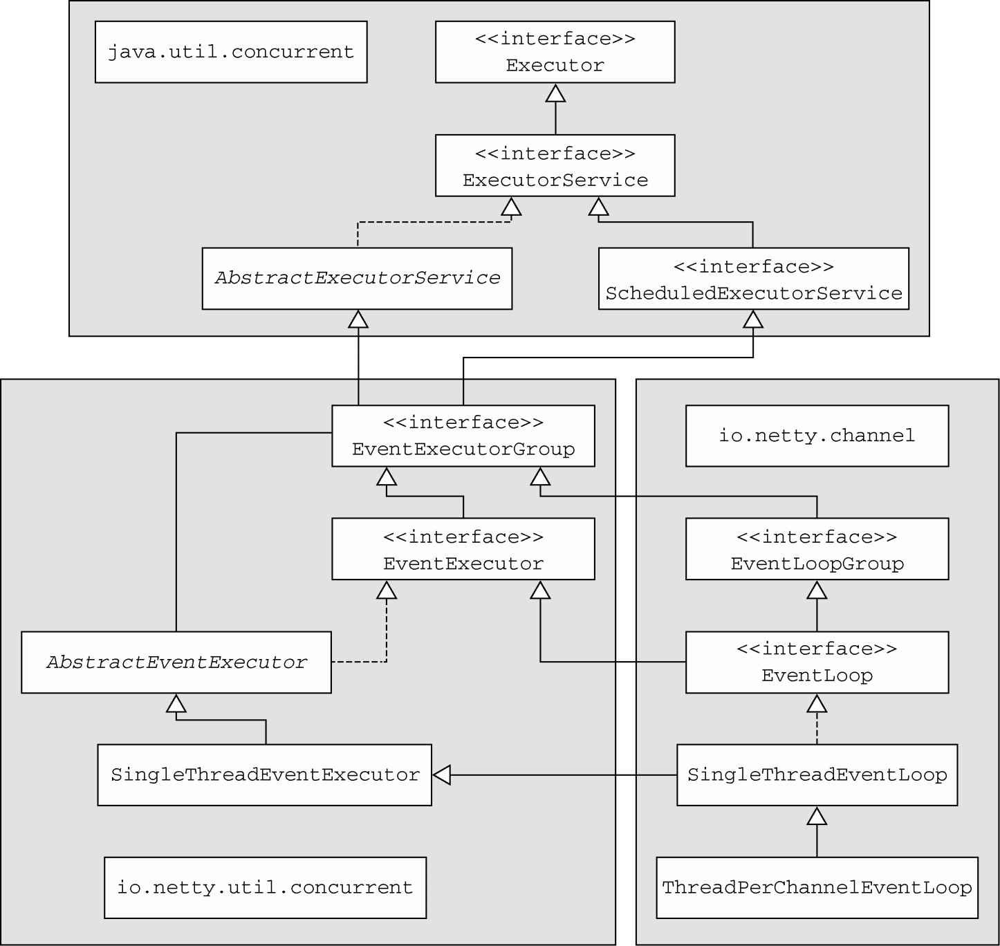
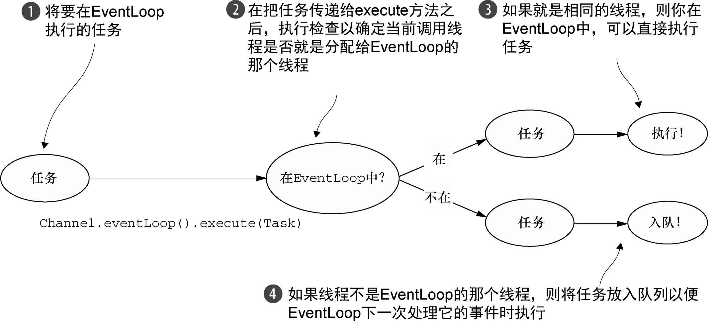
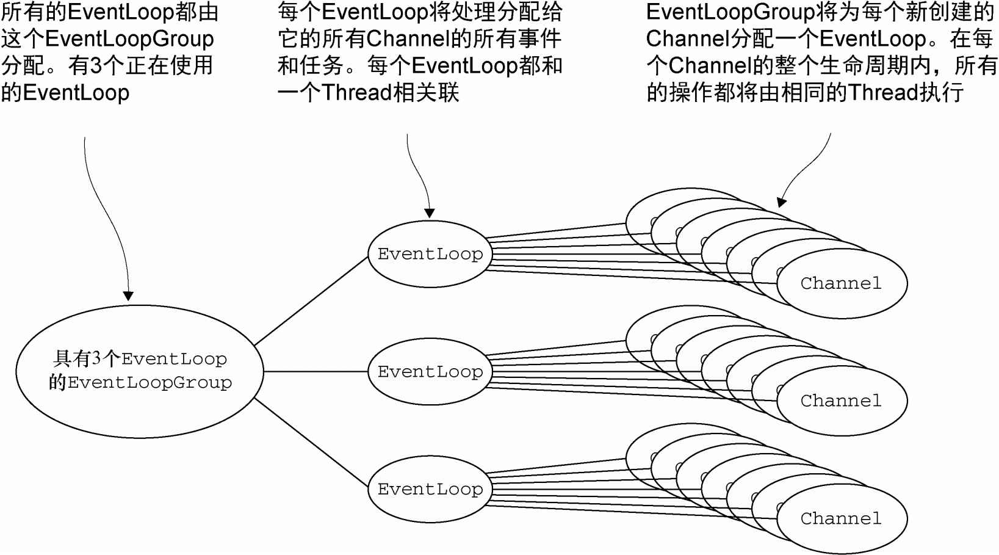
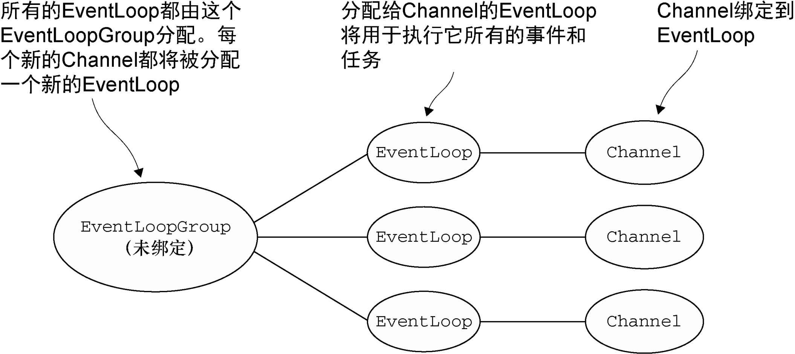

### EventLoop接口 ###

Netty的EventLoop是协同设计的一部分，它采用了两个基本的API：并发和网络编程。首先，`io.netty.util.concurrent`包构建在JDK的`java.util.concurrent`包上，用来提供线程执行器。其次，`io.netty.channel`包中的类，为了与Channel的事件进行交互，扩展了这些接口/类。下图展示了生成的类层次结构。



在这个模型中，**一个EventLoop将由一个永远都不会改变的Thread驱动，同时任务（Runnable或者Callable）可以直接提交给EventLoop实现，以立即执行或者调度执行**。根据配置和可用核心的不同，可能会创建多个EventLoop实例用以优化资源的使用，并且单个EventLoop可能会被指派用于服务多个Channel。


### 任务调度 ###

#### JDK的任务调度API ####

```java
/**
 * Scheduling a task with a ScheduledExecutorService
 */
public static void schedule() {
	ScheduledExecutorService executor = new ScheduledThreadPoolExecutor(10, new ThreadFactory() {
		private final AtomicInteger count = new AtomicInteger(1);

		@Override
		public Thread newThread(Runnable r) {
			Thread thread = new Thread(r);
			thread.setDaemon(true);
			thread.setName("thread-test-" + count.getAndIncrement());

			return thread;
		}
	});

	executor.schedule(()-> System.out.println("Now it is 60 seconds later"),
			60, TimeUnit.SECONDS);
	executor.shutdown();
}
```


#### 使用EventLoop调度任务 ####

ScheduledExecutorService的实现具有局限性，例如，事实上作为线程池管理的一部分，将会有额外的线程创建。如果有大量任务被紧凑地调度，那么这将成为一个瓶颈。Netty通过Channel的EventLoop实现任务调度解决了这一问题，如下代码所示。

```java
/**
 * Scheduling a task with EventLoop
 */
public static void scheduleViaEventLoop() {
	Channel channel = CHANNEL_FROM_SOMEWHERE;

	channel.eventLoop().schedule(()-> System.out.println("Now it is 60 seconds later"),
			60, TimeUnit.SECONDS);
}
```

经过60秒之后，Runnable实例将由分配给Channel的EventLoop执行。如果要调度任务以每隔60秒执行一次，请使用scheduleAtFixedRate()方法。

```java
/**
 * Scheduling a recurring task with EventLoop
 */
public static void scheduleFixedViaEventLoop() {
	Channel channel = CHANNEL_FROM_SOMEWHERE;

	channel.eventLoop().scheduleAtFixedRate(()-> System.out.println("Run every 60 seconds"),
			60, 60, TimeUnit.SECONDS);
}
```

要想取消或者检查（被调度任务的）执行状态，可以使用每个异步操作所返回的`ScheduledFuture`。

```java
/**
 * Canceling a task using ScheduledFuture
 */
public static void cancelingTaskUsingScheduledFuture() {
	Channel channel = CHANNEL_FROM_SOMEWHERE;

	ScheduledFuture<?> future = channel.eventLoop().scheduleAtFixedRate(() -> System.out.println("Run every 60 seconds"),
			60, 60, TimeUnit.SECONDS);

	// Some other code that runs...
	boolean mayInterruptIfRunning = false;
	future.cancel(mayInterruptIfRunning);
}
```


### 实现细节 ###

#### 线程管理 ####

Netty线程模型的卓越性能取决于对于当前执行的Thread的身份的确定，也就是说，确定它是否是分配给当前Channel以及它的EventLoop的那一个线程。（回想一下EventLoop将负责处理一个Channel的整个生命周期内的所有事件。）

如果（当前）调用线程正是支撑EventLoop的线程，那么所提交的代码块将会被（直接）执行。否则，EventLoop将调度该任务以便稍后执行，并将它放入到内部队列中。当EventLoop下次处理它的事件时，它会执行队列中的那些任务/事件。这也就解释了任何的Thread是如何与Channel直接交互而无需在ChannelHandler中进行额外同步的。



> 注意，每个EventLoop都有它自已的任务队列，独立于任何其他的EventLoop。


#### EventLoop/线程的分配 ####

服务于Channel的I/O和事件的EventLoop包含在EventLoopGroup中。根据不同的传输实现，EventLoop的创建和分配方式也不同。


1．异步传输

异步传输实现只使用了少量的EventLoop（以及和它们相关联的Thread），而且在当前的线程模型中，它们可能会被多个Channel所共享。这使得可以通过尽可能少量的Thread来支撑大量的Channel，而不是每个Channel分配一个Thread。




2．阻塞传输

用于像OIO（旧的阻塞I/O）这样的其他传输的设计略有不同，这里每一个Channel都将被分配给一个EventLoop（以及它的Thread）。如果你开发的应用程序使用过java.io包中的阻塞I/O实现，你可能就遇到过这种模型。



但是，正如同之前一样，得到的保证是每个Channel的I/O事件都将只会被一个Thread（用于支撑该Channel的EventLoop的那个Thread）处理。这也是另一个Netty设计一致性的例子，它（这种设计上的一致性）对Netty的可靠性和易用性做出了巨大贡献。

