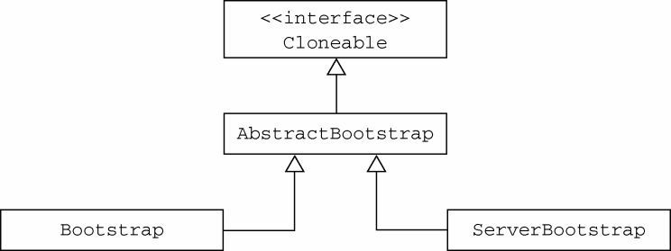
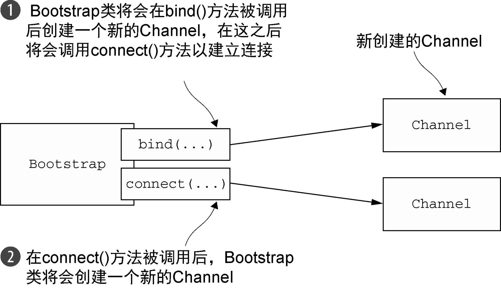
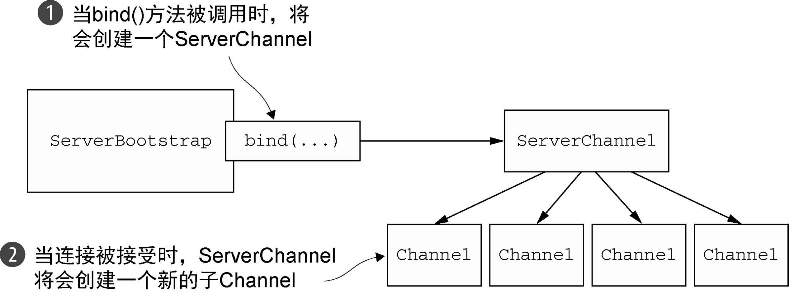
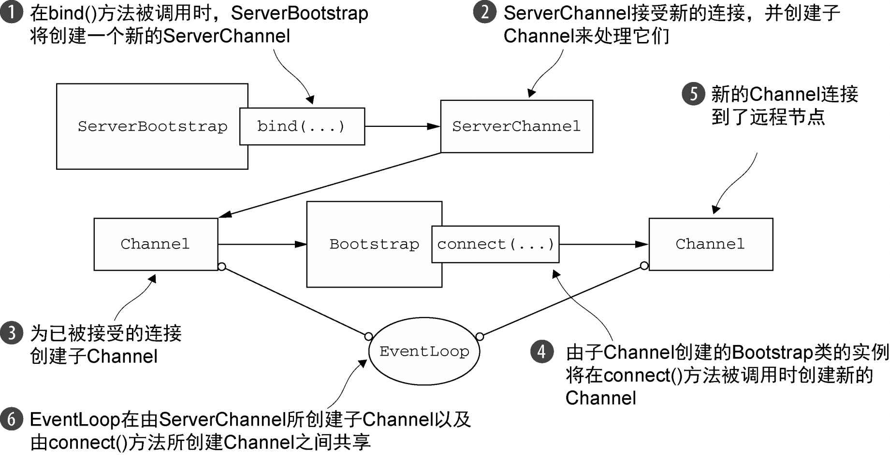

### Bootstrap类 ###

引导类的层次结构包括一个抽象的父类和两个具体的引导子类，如下图所示。



相对于将具体的引导类分别看作用于服务器和客户端的引导来说，记住它们的本意是用来支撑不同的应用程序的功能的将有所裨益。也就是说，服务器致力于使用一个父Channel来接受来自客户端的连接，并创建子Channel以用于它们之间的通信；而客户端将最可能只需要一个单独的、没有父Channel的Channel来用于所有的网络交互。


### 引导客户端 ###

Bootstrap类负责为客户端和使用无连接协议的应用程序创建Channel，如下图所示。



```java
/**
 * Bootstrapping a client
 */
public void bootstrap() throws InterruptedException {
	EventLoopGroup group = new NioEventLoopGroup();

	try {
		Bootstrap bootstrap = new Bootstrap();
		bootstrap.group(group)
				.channel(NioSocketChannel.class)
				.remoteAddress(new InetSocketAddress("127.0.0.1", 8080))
				.handler(new SimpleChannelInboundHandler<ByteBuf>() {
					@Override
					protected void channelRead0(ChannelHandlerContext ctx, ByteBuf msg) throws Exception {
						System.out.println("Client received: " + msg.toString(CharsetUtil.UTF_8));
					}
				});

		ChannelFuture future = bootstrap.connect().sync();
		future.addListener(channelFuture -> {
			if (channelFuture.isSuccess()) {
				System.out.println("Connection established");
			} else {
				System.err.println("Connection attempt failed");
				channelFuture.cause().printStackTrace();
			}
		});
	}finally {
		group.shutdownGracefully().sync();
	}
}
```


### 引导服务器 ###



```java
/**
 * Bootstrapping a server
 */
public void bootstrap() throws InterruptedException {
	EventLoopGroup group = new NioEventLoopGroup();

	try {
		ServerBootstrap bootstrap = new ServerBootstrap();
		bootstrap.group(group)
				.channel(NioServerSocketChannel.class)
				.localAddress(new InetSocketAddress(8080))
				.childHandler(new SimpleChannelInboundHandler<ByteBuf>(){

					@Override
					protected void channelRead0(ChannelHandlerContext ctx, ByteBuf msg) throws Exception {
						System.out.println("Server received: " + msg.toString(CharsetUtil.UTF_8));
					}
				});

		ChannelFuture future = bootstrap.bind().sync();
		future.addListener(channelFuture -> {
			if (channelFuture.isSuccess()) {
				System.out.println("Server bound");
			} else {
				System.err.println("Bind attempt failed");
				channelFuture.cause().printStackTrace();
			}
		});
	}finally {
		group.shutdownGracefully().sync();
	}
}
```


### 从Channel引导客户端 ###

假设你的服务器正在处理一个客户端的请求，这个请求需要它充当第三方系统的客户端。当一个应用程序（如一个代理服务器）必须要和组织现有的系统（如Web服务或者数据库）集成时，就可能发生这种情况。在这种情况下，将需要从已经被接受的子Channel中引导一个客户端Channel。

一个更好的解决方案是：通过将已被接受的子Channel的EventLoop传递给Bootstrap的group()方法来共享该EventLoop。因为分配给EventLoop的所有Channel都使用同一个线程，所以这避免了额外的线程创建，以及前面所提到的相关的上下文切换。这个共享的解决方案如下图所示。



实现EventLoop共享涉及通过调用group()方法来设置EventLoop，如下列代码所示。

```java
/**
 * Bootstrapping a server
 */
public void bootstrap() throws InterruptedException {
	ServerBootstrap bootstrap = new ServerBootstrap();
	bootstrap.group(new NioEventLoopGroup(), new NioEventLoopGroup())
			.channel(NioServerSocketChannel.class)
			.localAddress(new InetSocketAddress(8080))
			.childHandler(new SimpleChannelInboundHandler<ByteBuf>(){
				ChannelFuture connectFuture;

				@Override
				public void channelActive(ChannelHandlerContext ctx) throws Exception {
					//创建一个Bootstrap类的实例以连接到远程主机
					Bootstrap bootstrap = new Bootstrap();

					//使用与分配给已被接受的子Channel相同的EventLoop
					bootstrap.group(ctx.channel().eventLoop())
							.channel(NioSocketChannel.class)
							.remoteAddress(new InetSocketAddress("192.168.100.2", 8080))
							.handler(new SimpleChannelInboundHandler<ByteBuf>() {
								@Override
								protected void channelRead0(ChannelHandlerContext ctx, ByteBuf msg) throws Exception {
									System.out.println("Client received: " + msg.toString(CharsetUtil.UTF_8));
								}
							});

					connectFuture = bootstrap.connect();
				}

				@Override
				protected void channelRead0(ChannelHandlerContext ctx, ByteBuf msg) throws Exception {
					if (connectFuture.isDone()) {
						//连接完成时，执行一些数据操作（如代理）
					}
				}
			});

	ChannelFuture future = bootstrap.bind().sync();
	future.addListener(channelFuture -> {
		if (channelFuture.isSuccess()) {
			System.out.println("Server bound");
		} else {
			System.err.println("Bind attempt failed");
			channelFuture.cause().printStackTrace();
		}
	});
}
```

### 在引导过程中添加多个ChannelHandler ###

在所有我们展示过的代码示例中，我们都在引导的过程中调用了handler()或者childHandler()方法来添加单个的ChannelHandler。这对于简单的应用程序来说可能已经足够了，但是它不能满足更加复杂的需求。例如，一个必须要支持多种协议的应用程序将会有很多的ChannelHandler，而不会是一个庞大而又笨重的类。

正如你经常所看到的一样，你可以根据需要，通过在ChannelPipeline中将它们链接在一起来部署尽可能多的ChannelHandler。但是，如果在引导的过程中你只能设置一个ChannelHandler，那么你应该怎么做到这一点呢？

正是针对于这个用例，Netty提供了一个特殊的ChannelInboundHandlerAdapter子类：

```java
public abstract class ChannelInitializer<C extends Channel> extends ChannelInboundHandlerAdapter
```

它定义了下面的方法：

```java
protected abstract void initChannel(C ch) throws Exception;
```

这个方法提供了一种将多个ChannelHandler添加到一个ChannelPipeline中的简便方法。**你只需要简单地向Bootstrap或ServerBootstrap的实例提供你的ChannelInitializer实现即可，并且一旦Channel被注册到了它的EventLoop之后，就会调用你的initChannel()版本**。在该方法返回之后，ChannelInitializer的实例将会从ChannelPipeline中移除它自己。

```java
/**
 * Bootstrapping a server
 */
public void bootstrap() throws InterruptedException {
	ServerBootstrap bootstrap = new ServerBootstrap();
	bootstrap.group(new NioEventLoopGroup(), new NioEventLoopGroup())
			.channel(NioServerSocketChannel.class)
			.localAddress(new InetSocketAddress(8080))
            //注册一个ChannelInitializerImpl的实例来设置ChannelPipeline
			.childHandler(new ChannelInitializerImpl());

	bootstrap.bind().sync();
}


final class ChannelInitializerImpl extends ChannelInitializer<Channel> {

	@Override
	protected void initChannel(Channel ch) throws Exception {
		ChannelPipeline pipeline = ch.pipeline();
		
        //将所需的ChannelHandler添加到ChannelPipeline
		pipeline.addLast(new HttpClientCodec());
		pipeline.addLast(new HttpObjectAggregator(Integer.MAX_VALUE));
	}
}
```


### 使用Netty的ChannelOption和属性 ###

在每个Channel创建时都手动配置它可能会变得相当乏味。幸运的是，你不必这样做。相反，你可以使用option()方法来将ChannelOption应用到引导。你所提供的值将会被自动应用到引导所创建的所有Channel。可用的ChannelOption包括了底层连接的详细信息，如keep-alive或者超时属性以及缓冲区设置。

Netty应用程序通常与组织的专有软件集成在一起，而像Channel这样的组件可能甚至会在正常的Netty生命周期之外被使用。在某些常用的属性和数据不可用时，Netty提供了AttributeMap抽象（一个由Channel和引导类提供的集合）以及AttributeKey<T>（一个用于插入和获取属性值的泛型类）。使用这些工具，便可以安全地将任何类型的数据项与客户端和服务器Channel（包含ServerChannel的子Channel）相关联了。

```java
/**
 * Using attributes
 */
public void bootstrap() throws InterruptedException {
	//创建一个AttributeKey以标识该属性
	final AttributeKey<Integer> id = AttributeKey.newInstance("ID");

	Bootstrap bootstrap = new Bootstrap();
	bootstrap.group(new NioEventLoopGroup())
			.channel(NioSocketChannel.class)
			.remoteAddress(new InetSocketAddress("127.0.0.1", 8080))
			.handler(new SimpleChannelInboundHandler<ByteBuf>() {

				@Override
				public void channelRegistered(ChannelHandlerContext ctx) throws Exception {
					//使用AttributeKey检索属性以及它的值
					Integer idValue = ctx.channel().attr(id).get();
					// do something with the idValue
				}

				@Override
				protected void channelRead0(ChannelHandlerContext ctx, ByteBuf msg) throws Exception {
					System.out.println("Client received: " + msg.toString(CharsetUtil.UTF_8));
				}
			});

	bootstrap.option(ChannelOption.SO_KEEPALIVE, true)
			 .option(ChannelOption.CONNECT_TIMEOUT_MILLIS, 5000);
	//设置该id属性
	bootstrap.attr(id, 123456);

	bootstrap.bind().sync();
}
```


### 引导DatagramChannel ###

前面的引导代码示例使用的都是基于TCP协议的SocketChannel，但是Bootstrap类也可以被用于无连接的协议。为此，Netty提供了各种DatagramChannel的实现。唯一区别就是，不再调用connect()方法，而是只调用bind()方法，如下列代码所示。

```java
/**
 * Using DatagramChannel
 */
public void bootstrap() throws InterruptedException {
	Bootstrap bootstrap = new Bootstrap();
	bootstrap.group(new NioEventLoopGroup())
			//指定Channel的实现
			.channel(NioDatagramChannel.class)
			.handler(new SimpleChannelInboundHandler<DatagramPacket>() {

				@Override
				protected void channelRead0(ChannelHandlerContext ctx, DatagramPacket msg) throws Exception {
					System.out.println("Client received: " + msg.toString());
				}
			});

	//调用bind()方法，因为该协议是无连接的
	ChannelFuture future = bootstrap.bind(new InetSocketAddress(0));
	future.addListener(channelFuture -> {
		if (channelFuture.isSuccess()) {
			System.out.println("Connection established");
		} else {
			System.err.println("Connection attempt failed");
			channelFuture.cause().printStackTrace();
		}
	});
}
```

