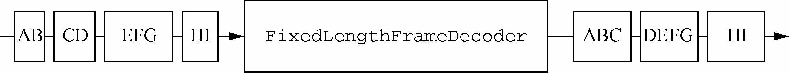
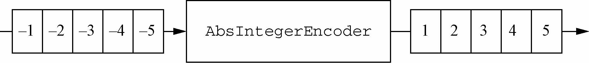
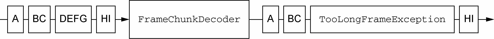

### 使用EmbeddedChannel测试ChannelHandler ###

#### 测试入站消息 ####

下图展示了一个简单的ByteToMessageDecoder实现。给定足够的数据，这个实现将产生固定大小的帧。如果没有足够的数据可供读取，它将等待下一个数据块的到来，并将再次检查是否能够产生一个新的帧。



这个特定的解码器将产生固定为3字节大小的帧。最终，每个帧都会被传递给ChannelPipeline中的下一个ChannelHandler。

该解码器的实现，如下代码所示：

```java
public class FixedLengthFrameDecoder extends ByteToMessageDecoder {
    private final int frameLength;

    public FixedLengthFrameDecoder(int frameLength) {
        if (frameLength <= 0) {
            throw new IllegalArgumentException("frameLength must be a positive integer: " + frameLength);
        }
        this.frameLength = frameLength;
    }
    
    @Override
    protected void decode(ChannelHandlerContext ctx, ByteBuf in, List<Object> out) throws Exception {
        //检查是否有足够的字节可以被读取，以生成下一个帧
        while (in.readableBytes() >= this.frameLength){
            //从ByteBuf中读取一个新帧
            ByteBuf buf = in.readBytes(this.frameLength);
            //将该帧添加到已被解码的消息列表中
            out.add(buf);
        }
    }
}
```

现在，让我们创建一个单元测试，以确保这段代码将按照预期执行。正如我们前面所指出的，即使是在简单的代码中，单元测试也能帮助我们防止在将来代码重构时可能会导致的问题，并且能在问题发生时帮助我们诊断它们。

```java
package cn.zifangsky.netty.exercise.chapter9;

import io.netty.buffer.ByteBuf;
import io.netty.buffer.Unpooled;
import io.netty.channel.embedded.EmbeddedChannel;
import org.junit.jupiter.api.Test;

import static org.junit.jupiter.api.Assertions.*;

/**
 * Testing the FixedLengthFrameDecoder
 *
 * @author zifangsky
 * @date 2020/10/19
 * @since 1.0.0
 */
public class FixedLengthFrameDecoderTest {

    @Test
    public void testFramesDecoded() {
        ByteBuf buf = Unpooled.buffer();
        for (int i = 0; i < 9; i++) {
            buf.writeByte(i);
        }
        ByteBuf input = buf.duplicate();
        EmbeddedChannel channel = new EmbeddedChannel(
                new FixedLengthFrameDecoder(3));

        // write bytes
        assertTrue(channel.writeInbound(input.retain()));
        assertTrue(channel.finish());

        // read messages
        ByteBuf read = channel.readInbound();
        assertEquals(buf.readSlice(3), read);
        read.release();

        read = channel.readInbound();
        assertEquals(buf.readSlice(3), read);
        read.release();

        read = channel.readInbound();
        assertEquals(buf.readSlice(3), read);
        read.release();

        assertNull(channel.readInbound());
        buf.release();
    }

    @Test
    public void testFramesDecoded2() {
        ByteBuf buf = Unpooled.buffer();
        for (int i = 0; i < 9; i++) {
            buf.writeByte(i);
        }
        ByteBuf input = buf.duplicate();

        EmbeddedChannel channel = new EmbeddedChannel(
                new FixedLengthFrameDecoder(3));
        //返回false，因为没有一个完整的可供读取的帧（只有当有3个或者更多的字节可供读取时，FixedLengthFrameDecoder才会产生输出）
        assertFalse(channel.writeInbound(input.readBytes(2)));
        assertTrue(channel.writeInbound(input.readBytes(7)));

        assertTrue(channel.finish());
        ByteBuf read = channel.readInbound();
        assertEquals(buf.readSlice(3), read);
        read.release();

        read = channel.readInbound();
        assertEquals(buf.readSlice(3), read);
        read.release();

        read = channel.readInbound();
        assertEquals(buf.readSlice(3), read);
        read.release();

        assertNull(channel.readInbound());
        buf.release();
    }

}
```


#### 测试出站消息 ####

现在我们只需要简单地提及我们正在测试的处理器——AbsIntegerEncoder，它是Netty的MessageToMessageEncoder的一个特殊化的实现，用于将负值整数转换为绝对值。

该示例将会按照下列方式工作：

- 持有AbsIntegerEncoder的EmbeddedChannel将会以4字节的负整数的形式写出站数据；
- 编码器将从传入的ByteBuf中读取每个负整数，并将会调用Math.abs()方法来获取其绝对值；
- 编码器将会把每个负整数的绝对值写到ChannelPipeline中。



```java
public class AbsIntegerEncoder extends MessageToMessageEncoder<ByteBuf> {

    @Override
    protected void encode(ChannelHandlerContext ctx, ByteBuf msg, List<Object> out) throws Exception {
        while (msg.readableBytes() >= 4) {
            int value = Math.abs(msg.readInt());
            out.add(value);
        }
    }
}
```

以下代码使用了EmbeddedChannel来测试代码。

```java
package cn.zifangsky.netty.exercise.chapter9;

import io.netty.buffer.ByteBuf;
import io.netty.buffer.Unpooled;
import io.netty.channel.embedded.EmbeddedChannel;
import org.junit.jupiter.api.Test;

import static org.junit.jupiter.api.Assertions.*;

/**
 * Testing the AbsIntegerEncoder
 *
 * @author zifangsky
 * @date 2020/10/19
 * @since 1.0.0
 */
public class AbsIntegerEncoderTest {

    @Test
    public void testEncoded() {
        ByteBuf buf = Unpooled.buffer();
        for (int i = 1; i < 10; i++) {
            buf.writeInt(i * -1);
        }

        EmbeddedChannel channel = new EmbeddedChannel(
            new AbsIntegerEncoder());
        assertTrue(channel.writeOutbound(buf));
        assertTrue(channel.finish());

        // read bytes
        for (int i = 1; i < 10; i++) {
            assertEquals(i, (Integer) channel.readOutbound());
        }
        assertNull(channel.readOutbound());
    }
}
```


#### 测试异常处理 ####

应用程序通常需要执行比转换数据更加复杂的任务。例如，你可能需要处理格式不正确的输入或者过量的数据。在下一个示例中，如果所读取的字节数超出了某个特定的限制，我们将会抛出一个TooLongFrameException。这是一种经常用来防范资源被耗尽的方法。

在下图中，最大的帧大小已经被设置为3字节。如果一个帧的大小超出了该限制，那么程序将会丢弃它的字节，并抛出一个TooLongFrameException。位于ChannelPipeline中的其他ChannelHandler可以选择在exceptionCaught()方法中处理该异常或者忽略它。



```java
public class FrameChunkDecoder extends ByteToMessageDecoder {
    private final int maxFrameSize;

    public FrameChunkDecoder(int maxFrameSize) {
        this.maxFrameSize = maxFrameSize;
    }

    @Override
    protected void decode(ChannelHandlerContext ctx, ByteBuf in, List<Object> out) throws Exception {
        int readableBytes = in.readableBytes();

        //如果该帧太大，则丢弃它并抛 出一个TooLongFrameException异常
        if(readableBytes > this.maxFrameSize){
            in.clear();
            throw new TooLongFrameException();
        }

        ByteBuf buf = in.readBytes(readableBytes);
        out.add(buf);
    }
}
```

我们再使用EmbeddedChannel来测试一次这段代码，如下代码所示。

```java
package cn.zifangsky.netty.exercise.chapter9;

import io.netty.buffer.ByteBuf;
import io.netty.buffer.Unpooled;
import io.netty.channel.embedded.EmbeddedChannel;
import io.netty.handler.codec.TooLongFrameException;
import org.junit.jupiter.api.Test;

import static org.junit.jupiter.api.Assertions.*;

/**
 * Testing FrameChunkDecoder
 *
 * @author zifangsky
 * @date 2020/10/19
 * @since 1.0.0
 */

public class FrameChunkDecoderTest {

    @Test
    public void testFramesDecoded() {
        ByteBuf buf = Unpooled.buffer();
        for (int i = 0; i < 9; i++) {
            buf.writeByte(i);
        }
        ByteBuf input = buf.duplicate();

        EmbeddedChannel channel = new EmbeddedChannel(
            new FrameChunkDecoder(3));

        assertTrue(channel.writeInbound(input.readBytes(2)));
        try {
            //向channel中写入一个4字节大小的帧，并捕获预期的TooLongFrameException异常
            channel.writeInbound(input.readBytes(4));
            fail();
        } catch (TooLongFrameException e) {
            // expected exception
        }
        
        //写入剩下的2字节，并断言将会产生一个有效帧
        assertTrue(channel.writeInbound(input.readBytes(3)));
        assertTrue(channel.finish());

        //读取产生的消息，并且验证值
        ByteBuf read = channel.readInbound();
        assertEquals(buf.readSlice(2), read);
        read.release();

        read = channel.readInbound();
        //中间几个位置没有值，所以需要跳过
        assertEquals(buf.skipBytes(4).readSlice(3), read);
        read.release();
        buf.release();
    }
}
```

